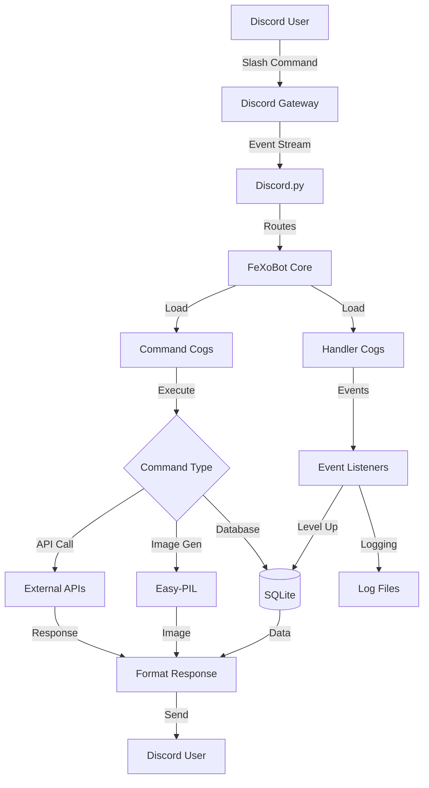

# Video & Media Assets

This document provides information about visual media assets, demo videos, GIFs, diagrams, and screenshots for FeXoBot.

---

## Demo Video

### Project Walkthrough
- **YouTube**: [FeXoBot Complete Demo](placeholder)
- **Duration**: 5-7 minutes
- **Topics Covered**:
  - Bot setup and configuration
  - Moderation command demonstrations
  - Interactive games showcase
  - API integrations (NASA, ChatGPT, PokeAPI)
  - Leveling system and level cards
  - Ticket system workflow
  - Advanced features overview

**Content Outline**:
1. **Introduction** (0:00-0:30)
   - What is FeXoBot?
   - Key features overview
2. **Setup & Configuration** (0:30-1:30)
   - Running `/setup` command
   - Configuring channels and roles
3. **Moderation Features** (1:30-2:30)
   - Warning system demo
   - Ban/kick commands
   - Role management
4. **Games & Entertainment** (2:30-3:30)
   - Hangman gameplay
   - Tic-Tac-Toe match
   - Pokémon lookup
5. **API Integrations** (3:30-4:30)
   - NASA APOD
   - ChatGPT conversation
   - Translation demo
6. **Leveling & Engagement** (4:30-5:30)
   - Level cards showcase
   - XP system explanation
   - Giveaway creation
7. **Conclusion** (5:30-7:00)
   - GitHub repository
   - How to get started
   - Community links

---

## Feature Animations (GIFs)

### 1. Setup Wizard
**Filename**: `setup-wizard.gif`  
**Location**: `.website/screenshots/setup-wizard.gif`  
**Description**: Interactive setup command showing channel and role configuration  
**Duration**: 10-15 seconds

**What to Show**:
- User runs `/setup`
- Bot prompts for welcome channel
- User selects channel from dropdown
- Configuration confirmation message

---

### 2. Level Card Generation
**Filename**: `level-card.gif`  
**Location**: `.website/screenshots/level-card.gif`  
**Description**: Level card generation with progress bar and stats  
**Duration**: 5 seconds

**What to Show**:
- User runs `/level`
- "Thinking..." indicator
- Beautiful level card appears with:
  - User avatar
  - Username
  - Current level
  - XP progress bar
  - XP count

---

### 3. Ticket System Flow
**Filename**: `ticket-workflow.gif`  
**Location**: `.website/screenshots/ticket-workflow.gif`  
**Description**: Complete ticket lifecycle from creation to closure  
**Duration**: 15-20 seconds

**What to Show**:
- User clicks "Create Ticket" button
- Private ticket channel created
- Staff member joins and responds
- Ticket closed with transcript
- Transcript file sent

---

### 4. Hangman Game
**Filename**: `hangman-game.gif`  
**Location**: `.website/screenshots/hangman-game.gif`  
**Description**: Hangman gameplay with letter guessing  
**Duration**: 10-15 seconds

**What to Show**:
- Game starts with masked word
- User clicks letter buttons
- Correct letters revealed
- Win or lose screen

---

### 5. AI ChatGPT Response
**Filename**: `chatgpt-demo.gif`  
**Location**: `.website/screenshots/chatgpt-demo.gif`  
**Description**: ChatGPT responding to a question  
**Duration**: 8-10 seconds

**What to Show**:
- User runs `/chatgpt What is Python?`
- "Thinking..." indicator
- AI response appears in embed
- Formatted response with code blocks (if applicable)

---

### 6. NASA APOD
**Filename**: `nasa-apod.gif`  
**Location**: `.website/screenshots/nasa-apod.gif`  
**Description**: NASA Astronomy Picture of the Day feature  
**Duration**: 5 seconds

**What to Show**:
- User runs `/nasa apod`
- Beautiful space image loads
- Embed shows title, description, and image
- Date and copyright info

---

### 7. Pokémon Lookup
**Filename**: `pokemon-lookup.gif`  
**Location**: `.website/screenshots/pokemon-lookup.gif`  
**Description**: Pokémon information lookup  
**Duration**: 5 seconds

**What to Show**:
- User runs `/pokemon pikachu`
- Pokémon data loads
- Embed shows sprite, stats, types, abilities
- Clean formatted display

---

### 8. Moderation Warning
**Filename**: `warn-system.gif`  
**Location**: `.website/screenshots/warn-system.gif`  
**Description**: Warning system in action  
**Duration**: 5-8 seconds

**What to Show**:
- Moderator uses `/warn @user spam`
- Warning confirmation embed
- User's warning count updated
- Log message sent to logs channel

---

## Architecture Diagrams

### System Flow Diagram
**Format**: PNG or SVG  
**Location**: `.website/screenshots/architecture-diagram.png`

**Recommended Tool**: draw.io, Lucidchart, or Mermaid

**Mermaid Code**:


---

### Database Schema Diagram
**Format**: PNG or text-based ER diagram  
**Location**: `.website/screenshots/database-schema.png`

**Text-Based Alternative**:
```
┌─────────────────────┐
│       guild         │
├─────────────────────┤
│ guild_id (PK)       │
│ welcome_channel     │
│ announcement        │
│ gamechannel         │
│ tickets             │
│ ticketcategory      │
│ levels              │
│ ...                 │
└─────────────────────┘
         │
         │ 1:N
         ▼
┌─────────────────────┐
│      warnings       │
├─────────────────────┤
│ user_id             │
│ reason              │
│ moderator_id        │
│ timestamp           │
└─────────────────────┘

┌─────────────────────┐
│       levels        │
├─────────────────────┤
│ user_id (PK)        │
│ xp                  │
│ level               │
└─────────────────────┘

┌─────────────────────┐
│      tickets        │
├─────────────────────┤
│ ticket_number       │
│ user_id             │
│ channel_id          │
│ created_at          │
│ status              │
└─────────────────────┘
```

---

### Cog Structure Diagram
**Format**: PNG  
**Location**: `.website/screenshots/cog-structure.png`

**Visual Representation**:
```
FeXoBot (main.py)
│
├── Commands/
│   ├── admin_commands.py
│   ├── ban.py
│   ├── warn.py
│   ├── tickets.py
│   ├── roles.py
│   ├── poll.py
│   ├── giveaway.py
│   ├── fun.py
│   ├── math.py
│   ├── encrypter.py
│   └── ... (15+ cogs)
│
├── Games/
│   ├── hangman.py
│   ├── tictactoe.py
│   ├── pokemon.py
│   └── uno.py
│
└── Handlers/
    ├── api.py
    ├── levels.py
    ├── welcome.py
    ├── logs.py
    ├── setup.py
    └── views.py
```

---

## Screenshot Catalog

### Desktop Views

#### 1. Setup Wizard
**Filename**: `setup-wizard.png`  
**Location**: `.website/screenshots/setup-wizard.png`  
**Status**: ✅ **ADDED**
**Description**: Setup wizard interface showing bot configuration options


---

#### 2. Help Commands Overview
**Filename**: `help-commands.png`  
**Location**: `.website/screenshots/help-commands.png`  
**Status**: ✅ **ADDED**
**Description**: Comprehensive help menu showing all command categories


---

#### 3. Help Wizard Interface
**Filename**: `help-wizard.png`  
**Location**: `.website/screenshots/help-wizard.png`  
**Status**: ✅ **ADDED**
**Description**: Interactive help wizard for navigating commands


---

#### 4. Level Card Example
**Filename**: `level-card-example.png`  
**Location**: `.website/screenshots/level-card-example.png`  
**Status**: ✅ **ADDED**
**Description**: Generated level card with user avatar, progress bar, XP, and level stats


---

#### 5. Ticket Interface
**Filename**: `ticket-interface.png`  
**Location**: `.website/screenshots/ticket-interface.png`  
**Status**: ✅ **ADDED**
**Description**: Support ticket channel interface with welcome message and close button


---

#### 6. Hangman Game
**Filename**: `hangman.png`  
**Location**: `.website/screenshots/hangman.png`  
**Status**: ✅ **ADDED**
**Description**: Active Hangman game showing letter buttons and word progress


---

#### 7. NASA APOD (Astronomy Picture of the Day)
**Filename**: `nasa-apod.png`  
**Location**: `.website/screenshots/nasa-apod.png`  
**Status**: ✅ **ADDED**
**Description**: NASA Astronomy Picture of the Day with image and description


---

#### 8. Poll System
**Filename**: `poll-system.png`  
**Location**: `.website/screenshots/poll-system.png`  
**Status**: ✅ **ADDED**
**Description**: Interactive poll with voting buttons and real-time results


---

#### 9. Giveaway System
**Filename**: `giveaway-system.png`  
**Location**: `.website/screenshots/giveaway-system.png`  
**Status**: ✅ **ADDED**
**Description**: Giveaway interface showing prize, duration, and entry button


---

#### 10. Calculator Interface
**Filename**: `calculator-interface.png`  
**Location**: `.website/screenshots/calculator-interface.png`  
**Status**: ✅ **ADDED**
**Description**: Interactive calculator with button-based interface in Discord


---

### Additional Screenshots Needed (Optional)

#### 11. Games - Tic-Tac-Toe
**Filename**: `game-tictactoe.png`  
**Location**: `.website/screenshots/game-tictactoe.png`  
**Description**: Tic-Tac-Toe game board with moves  
**Resolution**: 1920x1080

---

#### 8. API - NASA APOD
**Filename**: `api-nasa.png`  
**Location**: `.website/screenshots/api-nasa.png`  
**Description**: NASA Astronomy Picture of the Day with description  
**Resolution**: 1920x1080

---

#### 9. API - ChatGPT
**Filename**: `api-chatgpt.png`  
**Location**: `.website/screenshots/api-chatgpt.png`  
**Description**: ChatGPT response to a question  
**Resolution**: 1920x1080

---

#### 10. API - Pokémon
**Filename**: `api-pokemon.png`  
**Location**: `.website/screenshots/api-pokemon.png`  
**Description**: Pokémon information with sprite and stats  
**Resolution**: 1920x1080

---

#### 11. Calculator GUI
**Filename**: `calculator-interface.png`  
**Location**: `.website/screenshots/calculator-interface.png`  
**Description**: Interactive calculator with number buttons  
**Resolution**: 1920x1080

---

#### 12. Giveaway System
**Filename**: `giveaway-system.png`  
**Location**: `.website/screenshots/giveaway-system.png`  
**Description**: Active giveaway with participation button  
**Resolution**: 1920x1080

---

#### 13. Poll System
**Filename**: `poll-system.png`  
**Location**: `.website/screenshots/poll-system.png`  
**Description**: Poll with multiple options and voting buttons  
**Resolution**: 1920x1080

---

#### 14. Translation Demo
**Filename**: `translation-demo.png`  
**Location**: `.website/screenshots/translation-demo.png`  
**Description**: Text translation between languages  
**Resolution**: 1920x1080

---

#### 15. Server Dashboard (Future)
**Filename**: `web-dashboard.png`  
**Location**: `.website/screenshots/web-dashboard.png`  
**Description**: Placeholder for future web dashboard  
**Note**: Mark as "Coming in v2.5"

---

### Mobile Views

**Note**: FeXoBot is primarily used via Discord desktop/mobile app, not a standalone mobile interface.

Screenshots should show Discord mobile app interface with bot commands.

---

## Presentation Materials

### Slide Deck
**Format**: PDF  
**Location**: `.website/presentation/FeXoBot-Presentation.pdf`

**Slide Outline**:
1. **Title Slide**: FeXoBot - Feature-Rich Discord Bot
2. **Problem Statement**: Discord server management challenges
3. **Solution**: All-in-one bot with 100+ commands
4. **Architecture**: Modular cog-based design
5. **Key Features**: Moderation, Games, APIs, Leveling
6. **Technical Stack**: Python 3.12, Discord.py, SQLite
7. **Demo Screenshots**: Live examples
8. **Performance**: Metrics and benchmarks
9. **Future Roadmap**: v2.0, v3.0, v4.0 plans
10. **Open Source**: GitHub, contributions, community
11. **Thank You**: Links and contact info

---

### Pitch Video (1-Minute)
**Format**: MP4  
**Location**: `.website/videos/pitch-video.mp4`

**Script Outline**:
- **0-10s**: "Meet FeXoBot, the all-in-one Discord bot"
- **10-20s**: "100+ commands for moderation, games, and utilities"
- **20-30s**: "Powered by AI with ChatGPT integration"
- **30-40s**: "12+ API integrations for rich features"
- **40-50s**: "Easy setup, highly customizable"
- **50-60s**: "Open source and free. Get started today!"

---

## Creating Media Assets

### Recording Setup

#### Screen Recording Tools
- **OBS Studio** (Free, open-source) - Recommended
- **Loom** (Easy to use, free tier)
- **ShareX** (Windows, free)
- **QuickTime** (macOS, built-in)
- **Kazam** (Linux)

#### Settings
- **Resolution**: 1920x1080 (Full HD)
- **Frame Rate**: 30 FPS minimum, 60 FPS preferred
- **Audio**: Microphone narration + system audio
- **Format**: MP4 (H.264 codec)

---

### Screenshot Tools

- **Windows**: Snipping Tool, ShareX, Greenshot
- **macOS**: Cmd+Shift+4, CleanShot X
- **Linux**: Flameshot, GNOME Screenshot
- **Cross-platform**: Lightshot

#### Best Practices
- Use consistent Discord theme (dark mode recommended)
- Clear, readable font sizes
- Show complete UI context (don't crop too much)
- Use dummy data (no real user IDs)
- Consistent Discord username/avatar for demos

---

### GIF Creation

#### Tools
- **ScreenToGif** (Windows, free)
- **LICEcap** (macOS/Windows, free)
- **Peek** (Linux)
- **Kap** (macOS, open-source)

#### Settings
- **Duration**: 5-15 seconds max
- **Frame Rate**: 15-24 FPS (balance quality/size)
- **Resolution**: 1280x720 or 1920x1080
- **File Size**: Under 5 MB (optimize with ezgif.com)
- **Loop**: Yes (infinite loop)

---

### Diagram Creation

#### Tools
- **draw.io** (Free, web-based) - Recommended
- **Lucidchart** (Free tier available)
- **Mermaid** (Text-based, integrates with Markdown)
- **Excalidraw** (Hand-drawn style)
- **PlantUML** (Code-based diagrams)

---

## Media Guidelines

### Visual Consistency
- Use FeXoBot brand colors (if defined)
- Consistent Discord theme across screenshots
- Professional, clean presentation
- No sensitive information (real tokens, user data)

### Accessibility
- High contrast for readability
- Alt text descriptions for images
- Closed captions for videos
- Text-based alternatives for diagrams

### File Naming
- Use descriptive, lowercase names
- Separate words with hyphens
- Include version number if applicable
- Examples:
  - `setup-wizard-v1.2.gif`
  - `level-card-example.png`
  - `architecture-diagram-2025.svg`

---

## Asset Checklist

Before finalizing media assets:

- [ ] All screenshots captured in 1920x1080
- [ ] GIFs optimized (< 5 MB each)
- [ ] Demo video uploaded to YouTube
- [ ] Architecture diagram created
- [ ] Database schema visualized
- [ ] Presentation slides created
- [ ] No sensitive information in any media
- [ ] All files properly named
- [ ] Files organized in `.website/screenshots/`
- [ ] Alt text written for accessibility

---

## Using Media Assets

### In Documentation
```markdown

*Interactive setup wizard for bot configuration*
```

### In Portfolio Website
```html

```

### In Presentations
- Embed screenshots in slides
- Use GIFs for live demonstrations
- Link to YouTube demo video

---

## Update Schedule

- **Screenshots**: Update when UI changes significantly
- **GIFs**: Recreate for major feature updates
- **Demo Video**: Yearly or for major version releases
- **Diagrams**: Update with architecture changes

---

**Last Updated**: November 18, 2025  
**Media Version**: v1.0
