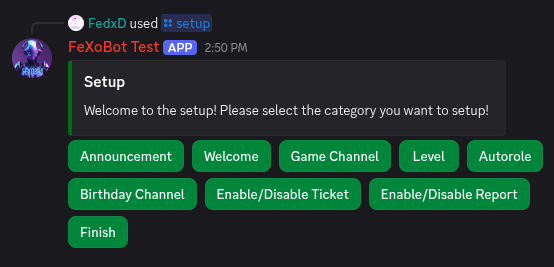
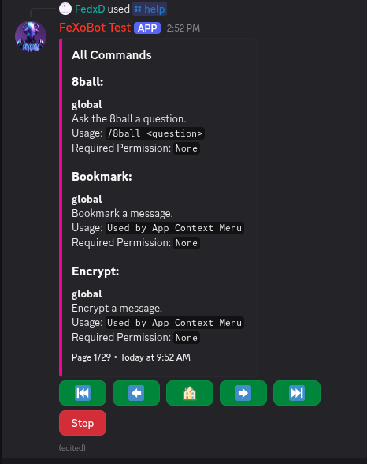
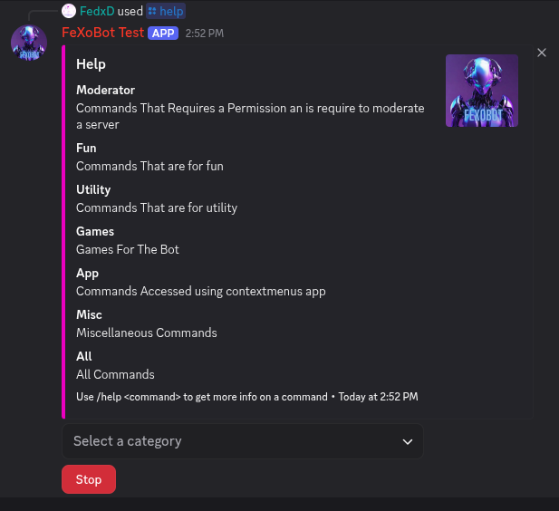
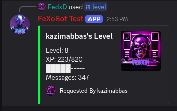
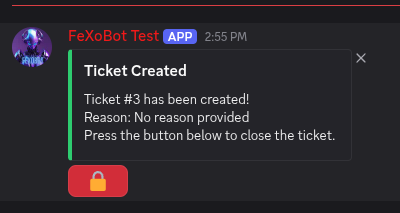
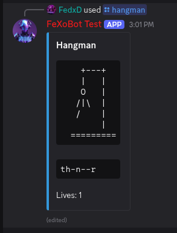
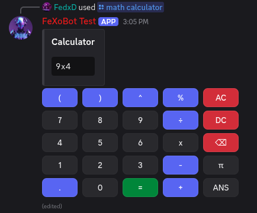
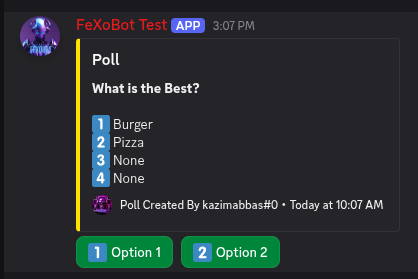
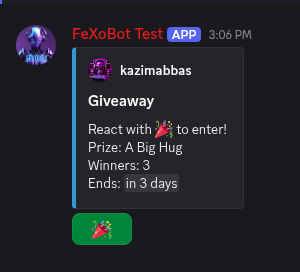
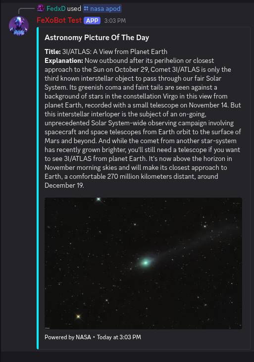

# FeXoBot - Project Overview

## Long Description

FeXoBot is a comprehensive, feature-rich Discord bot built with Python 3.12 and Discord.py 2.0+, designed to be an all-in-one solution for Discord server management and user engagement. With over 100 commands spanning moderation, entertainment, utilities, and API integrations, FeXoBot provides server administrators with powerful tools while offering engaging experiences for members.

The bot leverages a modular cog-based architecture that ensures maintainability, scalability, and ease of feature addition. From advanced moderation systems with warning tracking to interactive games like Hangman and Tic-Tac-Toe, FeXoBot combines utility with entertainment. The integration of AI capabilities through GPT-4 Free API enables intelligent chatbot responses, while connections to 12+ external APIs (NASA, PokeAPI, Google Translate, Currency Converter, etc.) provide rich, data-driven features.

Built with performance in mind, FeXoBot utilizes SQLite for efficient data persistence, asyncio for non-blocking operations, and implements proper error handling and logging systems. The bot features a sophisticated leveling system with automatic role rewards, a complete support ticket system with transcript generation, and extensive customization options through an interactive setup wizard.

## Problem Statement

Discord servers often struggle with several challenges:

1. **Fragmented Bot Ecosystem**: Server administrators typically need multiple bots to achieve comprehensive functionality - one for moderation, another for games, a third for utilities, etc. This creates management overhead and potential conflicts.

2. **Limited Engagement Tools**: Many bots focus solely on moderation or utilities, lacking features that promote member engagement and community building.

3. **Complex Setup Processes**: Most feature-rich bots require extensive configuration through web dashboards or complex command sequences.

4. **Poor API Integration**: Few bots offer extensive third-party API integrations, limiting access to external data sources and services.

5. **Lack of Customization**: Many bots provide rigid functionality without allowing servers to customize features to their specific needs.

FeXoBot addresses these pain points by providing a unified, feature-complete solution with an intuitive setup process, extensive customization options, and rich API integrations - all while maintaining high performance and reliability.

## Target Audience

### Primary Users
- **Discord Server Administrators**: Looking for an all-in-one bot solution to manage their communities
- **Gaming Communities**: Needing moderation tools alongside entertainment features
- **Educational Servers**: Requiring utility commands, math tools, and information lookup features
- **Tech Communities**: Wanting AI integration, API access, and technical utilities

### Secondary Users
- **Server Members**: Benefiting from games, utility commands, and engagement features
- **Bot Developers**: Learning from the modular architecture and implementation patterns
- **Community Managers**: Utilizing advanced moderation and ticketing systems

## What Makes This Project Unique?

### 1. **Comprehensive Feature Set**
Unlike specialized bots, FeXoBot offers 100+ commands across moderation, games, utilities, and APIs - eliminating the need for multiple bots.

### 2. **Modular Cog Architecture**
Built with Discord.py's cog system, allowing hot-reloading of features without downtime and easy feature additions.

### 3. **Advanced Mathematical Capabilities**
Includes a custom math interpreter supporting complex expressions, equation solving, and an interactive GUI calculator within Discord.

### 4. **12+ API Integrations**
Seamlessly integrates with NASA, PokeAPI, ChatGPT, Google services, and more - providing rich, real-time data access.

### 5. **Complete Ticketing System**
Full-featured support ticket system with category management, transcript generation, and staff role notifications.

### 6. **Intelligent Leveling System**
Automated XP tracking with customizable role rewards at multiple milestones, encouraging member engagement.

### 7. **Context Menu Commands**
Right-click context menus for quick actions like message translation, encryption, reporting, and AI explanations.

### 8. **Self-Contained Setup**
Single `/setup` command wizard that configures all bot features interactively - no web dashboard required.

## Visual Representation

### Bot Architecture Diagram
```
┌─────────────────────────────────────────────┐
│            FeXoBot Main Bot                 │
│         (Cog-Based Architecture)            │
└─────────────────┬───────────────────────────┘
                  │
        ┌─────────┴─────────┐
        │                   │
   ┌────▼────┐        ┌────▼────┐
   │Commands │        │Handlers │
   │ Cogs    │        │ Cogs    │
   └────┬────┘        └────┬────┘
        │                  │
   ┌────┴───────────┐  ┌──┴─────────┐
   │ 15+ Command    │  │ Event      │
   │ Modules        │  │ Handlers   │
   └────────────────┘  └────────────┘
```

### Feature Categories
- 🛡️ **Moderation**: Warnings, Bans, Mutes, Role Management
- 🎮 **Games**: Hangman, Tic-Tac-Toe, Pokémon, Trivia
- 🔧 **Utilities**: Translation, Currency, Timers, Encryption
- 🧮 **Mathematics**: Calculators, Equation Solvers, Statistics
- 🌐 **APIs**: NASA, ChatGPT, Weather, Jokes, Facts
- 📊 **Engagement**: Leveling, Giveaways, Polls, Reaction Roles
- 🎫 **Support**: Ticket System, Reporting, Feedback

## Visual Representation

### Feature Screenshots

#### 1. Setup Wizard

*Interactive setup wizard for configuring all bot features*

---

#### 2. Help System

*Comprehensive help menu with command categories*


*Interactive help wizard interface*

---

#### 3. Level Card System

*Beautiful XP and level progress card with user statistics and progress bar*

---

#### 4. Support Ticket System

*Support ticket creation and management interface with close functionality*

---

#### 5. Interactive Games

*Hangman gameplay with interactive letter buttons*

---

#### 6. Interactive Calculator

*Discord-based GUI calculator with button interactions for complex math*

---

#### 7. Poll & Voting System

*Interactive polls with real-time vote tracking*

---

#### 8. Giveaway System

*Automated giveaway system with entry tracking*

---

#### 9. API Integrations - NASA

*NASA Astronomy Picture of the Day integration*

---

### Architecture Overview
