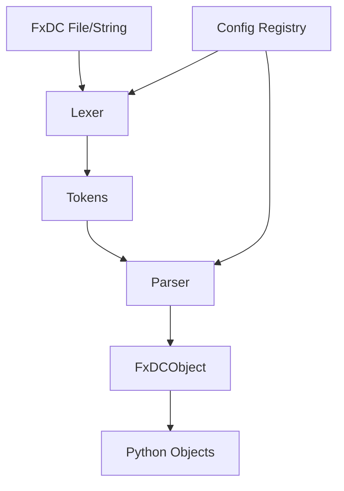

# Admin Instructions - Manual Tasks

This file contains tasks that need to be completed manually to finalize the project documentation for your portfolio website.

## 📸 Task 1: Capture Screenshots ✅ COMPLETED

### Status: ✅ All Required Screenshots Added!

All 4 required screenshots have been successfully captured and added to `.website/screenshots/`:

#### 1. Terminal Usage Screenshot ✅
- **Filename**: `terminal-usage.png`
- **Location**: `.website/screenshots/terminal-usage.png`
- **Status**: ✅ Added

#### 2. FxDC File in Code Editor ✅
- **Filename**: `vscode-fxdc-file.png.png`
- **Location**: `.website/screenshots/vscode-fxdc-file.png.png`
- **Status**: ✅ Added

#### 3. Error Message Example ✅
- **Filename**: `error-message.png`
- **Location**: `.website/screenshots/error-message.png`
- **Status**: ✅ Added

#### 4. Class Registration Code ✅
- **Filename**: `class-registration.png`
- **Location**: `.website/screenshots/class-registration.png`
- **Status**: ✅ Added

---

## 🎬 Task 2: Create Demo Video (Optional)

### What to Create:
A 5-7 minute walkthrough video demonstrating FxDC features.

### Where to Add:
Upload to YouTube, then update `media.md` with the link.

### Instructions:

1. **Record the Demo**:
   - Use screen recording tool (OBS Studio, SimpleScreenRecorder, QuickTime, etc.)
   - Resolution: 1920x1080
   - Include audio narration explaining features
   - Cover:
     - Installation (`pip install fxdc`)
     - Basic usage (dumps/loads)
     - Custom class registration
     - FxDCField with validation
     - Configuration export/import
     - Quick comparison with JSON
   - Keep it concise (5-7 minutes max)

2. **Edit the Video**:
   - Add intro slide with project name and GitHub link
   - Add transitions between sections
   - Include captions if possible
   - Add outro with installation command and links

3. **Upload to YouTube**:
   - Title: "FedxD Data Container (FxDC) - Python Serialization Library Demo"
   - Description: Copy from `overview.md`
   - Add tags: python, serialization, data-format, configuration, fxdc, open-source
   - Set visibility (Public or Unlisted)

4. **Update Documentation**:
   - Open `.website/media.md`
   - Find line with `[Placeholder - Video not yet created]`
   - Replace with your YouTube URL
   - Save file

**Example**:
```markdown
Before: - **YouTube**: [Placeholder - Video not yet created]
After:  - **YouTube**: [FxDC Demo](https://youtube.com/watch?v=xxxxx)
```

---

## 🎨 Task 3: Create Feature GIFs (Optional)

### What to Create:
Short GIF animations showing key features in action (5-10 seconds each).

### Where to Add:
`.website/screenshots/` folder, referenced in `media.md`.

### Optional GIFs:

#### 1. Quick Start Animation
- **Filename**: `quickstart.gif`
- **Location**: `.website/screenshots/quickstart.gif`
- **Duration**: 10 seconds
- **Content**: Terminal showing:
  1. `pip install fxdc`
  2. Import and basic usage
  3. Output
- **Instructions**:
  1. Use GIF recording tool (LICEcap, ScreenToGif, Peek, etc.)
  2. Record terminal session
  3. Keep file size under 5MB
  4. Save to `.website/screenshots/`

#### 2. Class Registration GIF
- **Filename**: `class-registration.gif`
- **Location**: `.website/screenshots/class-registration.gif`
- **Duration**: 8 seconds
- **Content**: Typing out class definition with decorator
- **Instructions**: Same as above

---

## 📊 Task 4: Create Architecture Diagram (Optional)

### What to Create:
Visual system architecture diagram showing component relationships.

### Where to Add:
`.website/screenshots/architecture-diagram.png` or embed in `architecture.md`.

### Instructions:

1. **Choose a Tool**:
   - draw.io (free, web-based, recommended)
   - Mermaid (text-based, can embed directly in markdown)
   - Lucidchart
   - Excalidraw
   - ASCII art (simple)

2. **Create Diagram**:
   - Include components: Lexer, Parser, Config, FxDCObject
   - Show data flow with arrows
   - Label each component clearly
   - Use consistent colors/shapes
   - Based on the text diagrams in `media.md`

3. **Export**:
   - If using graphical tool: Save as PNG to `.website/screenshots/architecture-diagram.png`
   - If using Mermaid: Embed directly in `architecture.md`

4. **Update Documentation** (if using image):
   - Open `.website/architecture.md`
   - Add image reference in appropriate section:
     ```markdown
     
     ```

**Mermaid Example** (text-based, embed in markdown):


---

## 🔐 Task 5: Verify Sensitive Information Removal

### What to Check:
Ensure no API keys, passwords, or personal data in any generated files.

### Where to Check:
- All files in `.website/config-samples/`
- Code snippets in `features.md` and `architecture.md`
- All markdown files in `.website/`

### Instructions:

1. **Review Config Files**:
   - Open `.website/config-samples/pyproject.toml`
   - Check for:
     - Email addresses (should be generic or placeholder)
     - Any hardcoded credentials
     - Production URLs
   - Email `fedxdofficial@gmail.com` is public and OK to keep

2. **Review Code Snippets**:
   - Open `features.md`, `architecture.md`, and `setup.md`
   - Search all code blocks for sensitive data
   - Ensure all examples use placeholder data

3. **Review All Markdown Files**:
   - Run a search for common sensitive patterns:
     ```bash
     cd .website
     grep -r "password" .
     grep -r "secret" .
     grep -r "key.*=" .
     ```
   - Verify any matches are intentional examples, not real data

---

## 📝 Task 6: Update Performance Metrics (Optional)

### What to Add:
Real performance data if not already measured.

### Where to Add:
Update values in both `metadata.json` and `performance.md` if you measure real metrics.

### Instructions:

1. **Run Benchmark Tests** (optional):
   - Create a benchmark script:
     ```python
     import time
     from fxdc import dumps, loads
     
     # Benchmark simple dict
     data = {"name": "Alice", "age": 30, "email": "alice@example.com"}
     start = time.perf_counter()
     for _ in range(1000):
         fxdc_str = dumps(data)
         obj = loads(fxdc_str)
     end = time.perf_counter()
     print(f"Time for 1000 iterations: {(end - start) * 1000:.2f}ms")
     print(f"Average per iteration: {(end - start):.3f}ms")
     ```
   - Run and record results

2. **Update Documentation**:
   - Open `.website/performance.md`
   - Replace estimated metrics with real measurements
   - Be honest about performance characteristics

3. **Update metadata.json**:
   - Open `.website/metadata.json`
   - Update `"performance"` object with real data if measured

**Note**: The current metrics in `performance.md` are reasonable estimates. Only update if you want to provide measured benchmarks.

---

## ✅ Task 7: Final Review Checklist

### Before Publishing:

- [x] All required screenshots captured and added ✅
  - [x] terminal-usage.png ✅
  - [x] vscode-fxdc-file.png.png ✅
  - [x] error-message.png ✅
  - [x] class-registration.png ✅
- [ ] Sensitive information removed/verified
- [ ] All markdown files reviewed for accuracy
- [ ] GitHub repository link correct in `metadata.json`
- [ ] README.md copied to `.website/` (done automatically)
- [ ] pyproject.toml copied to `.website/config-samples/` (done automatically)
- [ ] `.website/` folder added to `.gitignore` (done automatically)

### Optional Enhancements:

- [ ] Demo video uploaded and link updated in `media.md`
- [ ] Feature GIFs created
- [ ] Architecture diagram created
- [ ] Performance benchmarks measured
- [ ] Additional screenshots for comprehensive coverage

---

## 🚀 Next Steps After Completion:

1. **Review Generated Documentation**:
   - Read through all markdown files in `.website/`
   - Check for accuracy and completeness
   - Fix any errors or inconsistencies

2. **Complete Manual Tasks**:
   - At minimum: Capture 1-2 screenshots
   - Optional: Create video, GIFs, diagrams

3. **Integrate into Portfolio Website**:
   - Copy `.website/` folder to your portfolio repository
   - Create a project detail page using the markdown files
   - Display screenshots and metadata
   - Link to GitHub repository and PyPI package

4. **Test All Links**:
   - Verify GitHub links work
   - Verify PyPI links work
   - Check all internal references

5. **Deploy Portfolio Website**:
   - Push changes to your portfolio repository
   - Deploy and verify everything displays correctly

---

## 📋 Quick Reference: File Locations

**Documentation Files** (all in `.website/`):
- `metadata.json` — Project metadata for portfolio site
- `overview.md` — Project description and problem statement
- `features.md` — Detailed feature descriptions with code
- `architecture.md` — System architecture and tech stack
- `setup.md` — Installation and configuration guide
- `performance.md` — Performance metrics and benchmarks
- `requirements.md` — System and software requirements
- `environment-variables.md` — Environment configuration (N/A for FxDC)
- `known-issues.md` — Bugs, limitations, workarounds
- `awards.md` — Recognition and achievements
- `future.md` — Roadmap and planned features
- `media.md` — Video and media asset information
- `admin_instructions.md` — This file

**Config Samples** (in `.website/config-samples/`):
- `pyproject.toml` — Package configuration
- `README.md` — Instructions for config samples

**Screenshots** (in `.website/screenshots/`):
- `README.md` — Instructions for screenshots
- (Your screenshots go here)

---

## 🆘 Need Help?

If you encounter issues completing these tasks:

1. **Check Documentation**: Review the main markdown files for examples
2. **GitHub Issues**: Search for similar questions
3. **Create Issue**: Open a new issue if stuck
4. **Email**: Contact fedxdofficial@gmail.com

---

**Remember**: The minimum requirement is just 1-2 screenshots. Everything else is optional but will make your portfolio more impressive!

Good luck! 🚀
