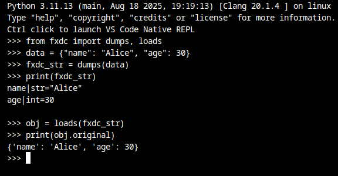
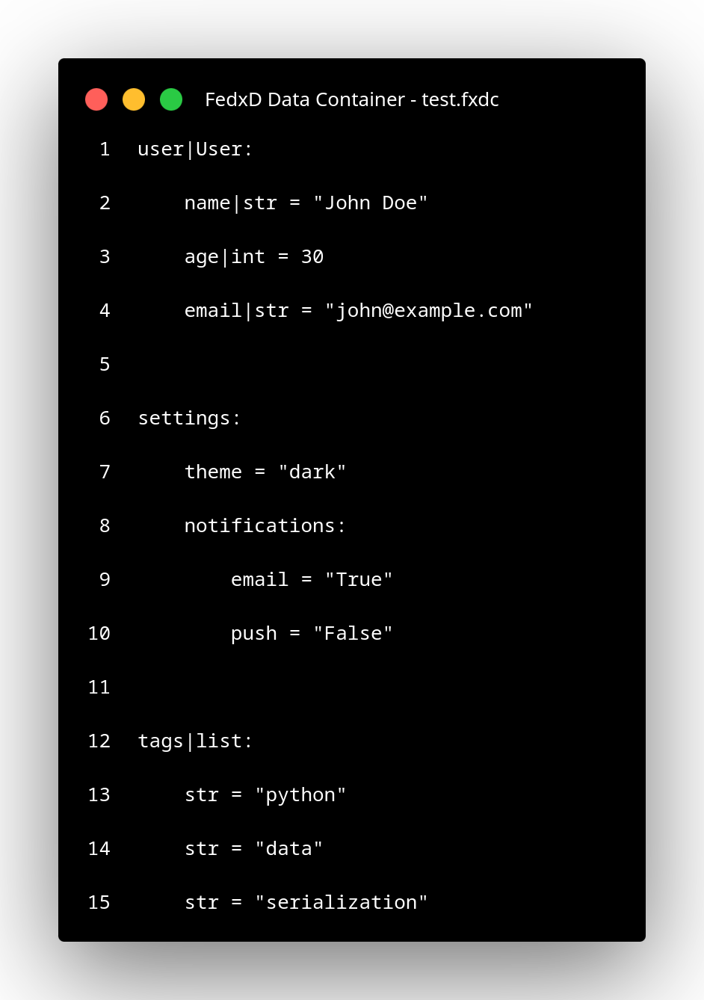
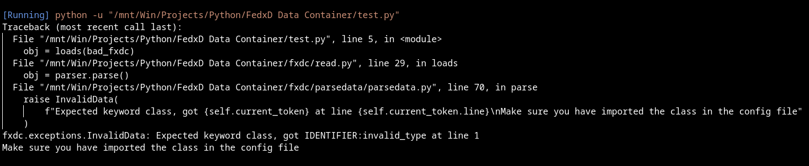
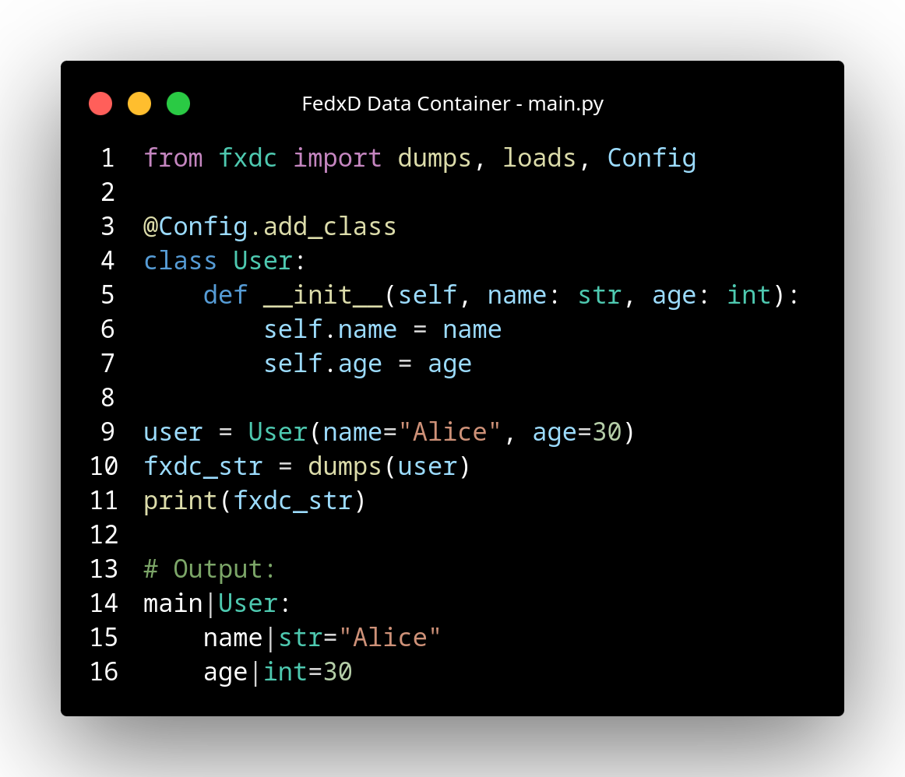

# Project Overview

**FedxD Data Container (FxDC)** is a custom data serialization format and parser library for Python that bridges the gap between human readability and programmatic power. Unlike JSON's rigid structure or YAML's ambiguous parsing, FxDC provides a clean, indentation-based syntax with native support for Python's type system, custom classes, and complex nested structures.

The library was designed to solve a common frustration: configuration files and data serialization formats that force you to choose between readability (YAML) and predictability (JSON), while neither natively understands Python objects. FxDC eliminates this trade-off by offering a format that reads like Python, validates like a type checker, and serializes custom classes without boilerplate code.

At its core, FxDC features a hand-built lexer and parser that tokenizes FxDC-formatted text into Python objects, complete with type hints, field validation, and automatic class reconstruction. The library supports round-trip serialization—you can dump Python objects (including custom classes) to `.fxdc` files and load them back with full type integrity.

## Problem Statement

Modern Python development involves constant serialization of structured data—configuration files, API responses, data pipelines, and object persistence. Existing formats fall short:

- **JSON** is verbose, doesn't support comments, and has no concept of Python types or custom classes
- **YAML** supports comments but has inconsistent parsing behavior and can't natively represent Python objects
- **Pickle** is binary, insecure, and not human-readable
- **XML** is overly verbose and cumbersome for simple structures

Developers need a format that:
- Is human-readable and editable
- Supports Python's type system natively
- Can serialize and deserialize custom classes without manual conversion logic
- Provides validation and type checking at parse time
- Maintains clean, predictable syntax

FxDC addresses all these needs by creating a Python-first data format with first-class support for types, classes, and validation.

## Target Audience

FxDC is ideal for:

- **Backend Developers**: Managing complex configuration files with type safety
- **Data Scientists**: Serializing Pandas DataFrames, NumPy arrays, and custom model classes
- **DevOps Engineers**: Creating readable, version-controllable config files that support comments
- **Library Authors**: Providing users with a clean format for plugin configurations or data definitions
- **Python Developers**: Anyone tired of writing boilerplate serialization code for custom classes

## What Makes This Project Unique

### 1. **Native Class Support with Zero Boilerplate**

Register any Python class once with `@Config.add_class`, and FxDC handles serialization/deserialization automatically:

```python
from fxdc import Config, dumps, loads

@Config.add_class
class User:
    def __init__(self, name, age):
        self.name = name
        self.age = age

user = User("Alice", 30)
fxdc_str = dumps(user)
# Output: main|User:\n    name|str = "Alice"\n    age|int = 30

loaded = loads(fxdc_str)
print(loaded.original)  # User object restored
```

For most classes, no additional code is needed. Implement `__todata__` and `__fromdata__` only when:
- The FxDC data fields don't match your `__init__` signature
- You need custom pre-processing logic before object creation

```python
@Config.add_class
class ComplexUser:
    def __init__(self, username):
        self.username = username
        self.session_data = {}  # Not in __init__, won't be in FxDC
    
    def __todata__(self):
        # Only serialize username, exclude session_data
        return {"username": self.username}
    
    # No __fromdata__ needed! __init__ matches FxDC data
```

### 2. **Hand-Built Lexer and Parser**

The library includes a complete tokenization and parsing system built from scratch, featuring:
- **Custom Token Types**: `TT_IDENTIFIER`, `TT_DEVIDER`, `TT_KEYWORD`, `TT_STRING`, etc.
- **Indentation-Aware Parsing**: Tracks indentation levels for nested structures
- **Type Hint Resolution**: Parses `variable|type = value` syntax with type validation

### 3. **Advanced Type Checking with Descriptors**

The `FxDCField` descriptor provides runtime type validation, default values, and rich metadata:

```python
from fxdc import FxDCField, Config

@Config.add_class
class Product:
    name: FxDCField[str] = FxDCField(
        desc="Product name",
        verbose_name="product_name",
        typechecking=True,
        null=False,
        blank=False,
        default="Unknown"
    )
    price: FxDCField[float] = FxDCField(typechecking=True)
```

Fields are validated on load, with clear error messages for type mismatches, null violations, or blank constraints.

### 4. **Configuration Portability**

Export and import class metadata across projects:

```python
Config.export_config("project_config.fxdc")
# Later, in another project:
Config.import_config("project_config.fxdc")
# All type checking, defaults, and validation rules are restored
```

This makes FxDC ideal for plugin systems, shared libraries, and team collaboration.

### 5. **Pre-Built Support for Common Types**

Out of the box, FxDC handles:
- **Python Built-ins**: `set`, `tuple`, `bytes`, `range`, `map`, `filter`, `enumerate`, `zip`
- **Pandas**: `DataFrame`
- **NumPy**: `NDArray`, `Matrix`
- **Datetime**: `Date`, `Time`, `DateTime`, `TimeDelta`

No manual registration required—these just work.

## Visual Representation

### Screenshots

#### Terminal Usage

*Python REPL showing FxDC dumps() and loads() operations*

#### VS Code Integration

*FxDC file opened in VS Code showing clean syntax*

#### Error Handling

*Helpful error messages with line numbers and context*

#### Class Registration

*Pythonic @Config.add_class decorator syntax*

### Example FxDC File

```fxdc
# User configuration
user|User:
    username|str = "john_doe"
    email|str = "john@example.com"
    age|int = 28
    is_active|bool = "True"

# Nested settings
settings:
    theme = "dark"
    notifications:
        email = "True"
        push = "False"

# List of items
tags|list:
    str = "python"
    str = "data"
    str = "serialization"
```

### Parsed Python Output

```python
{
    "user": User(username="john_doe", email="john@example.com", age=28, is_active=True),
    "settings": {
        "theme": "dark",
        "notifications": {
            "email": True,
            "push": False
        }
    },
    "tags": ["python", "data", "serialization"]
}
```

## Key Differentiators from Alternatives

| Feature | FxDC | JSON | YAML | Pickle |
|---------|------|------|------|--------|
| Human-Readable | ✅ | ✅ | ✅ | ❌ |
| Comments | ✅ | ❌ | ✅ | ❌ |
| Type Hints | ✅ | ❌ | ❌ | ❌ |
| Custom Classes | ✅ | ❌ | ❌ | ✅ |
| Type Validation | ✅ | ❌ | ❌ | ❌ |
| Multiline Values | ✅ | ❌ | ✅ | N/A |
| Pythonic Syntax | ✅ | ❌ | Partial | ❌ |
| Secure | ✅ | ✅ | ✅ | ❌ |
