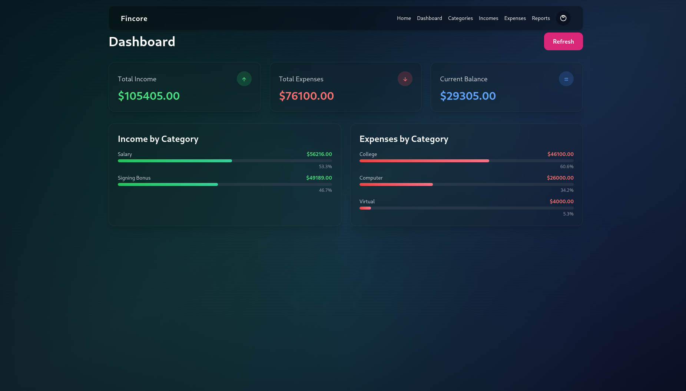

# Video & Media Assets# Video & Media Assets


This document catalogs all visual media assets for the FinCore portfolio documentation, including videos, screenshots, GIFs, and diagrams.## Demo Video


---### Project Walkthrough

- **YouTube**: [Project Demo](placeholder - to be added)

## 🎬 Demo Video- **Duration**: 5 minutes (target)

- **Format**: 1920x1080, MP4

### Main Project Walkthrough- **Status**: ⏳ **Not yet created**

- **YouTube**: [Project Demo](placeholder) ⚠️ **YOU NEED TO ADD THIS**

- **Duration**: 3-5 minutes**Planned Content**:

- **Format**: MP4, 1920x1080, 30fps1. Introduction (30s)

- **Topics Covered**:   - Project overview

  - Introduction and project overview   - Problem statement

  - Authentication flow (login/register)   - Key features

  - Dashboard tour (summary cards, category breakdowns)

  - Category management (create, hierarchy)2. Authentication Flow (45s)

  - Adding transactions (income and expense)   - Registration process

  - Reports and insights   - Email verification

  - Future features teaser (Zakat/Khums, mobile apps)   - Login flow

  

**How to Create**: See [admin_instructions.md](admin_instructions.md) Task 2 for complete guide.3. Feature Demonstrations (3 minutes)

   - Dashboard overview

**Script Provided**: 5-minute walkthrough script included in admin instructions.   - Adding categories

   - Creating income/expense

---   - Viewing reports


## 📸 Screenshots4. Technical Overview (1 minute)

   - Tech stack showcase

All screenshots located in `screenshots/` folder.   - Docker deployment

   - Code quality highlights

### Web Application Screenshots

5. Outro (15s)

#### 1. Homepage   - GitHub link

- **Filename**: `screenshots/homepage.png`   - Call to action (star, contribute, use)

- **Description**: Landing page with hero section, feature highlights, call-to-action

- **Resolution**: 1920x1080---

- **Status**: ⏳ To be captured

- **Priority**: MEDIUM## Feature Animations


#### 2. Login Page### 1. Dashboard Overview

- **Filename**: `screenshots/login.png`**File**: `screenshots/dashboard-demo.gif`

- **Description**: Authentication form with email and password inputs, glassmorphic design**Status**: ⏳ Not yet created

- **Resolution**: 1920x1080**Content**: 

- **Status**: ⏳ To be captured- Page load animation

- **Priority**: LOW- Summary cards appearing

- Category breakdowns expanding

#### 3. Registration Page- Hover effects on interactive elements

- **Filename**: `screenshots/register.png`

- **Description**: Registration form with email, password, confirm password fields**Specifications**:

- **Resolution**: 1920x1080- Duration: 10 seconds

- **Status**: ⏳ To be captured- Resolution: 1920x1080

- **Priority**: LOW- File Size: < 5 MB

- Format: GIF or MP4

#### 4. Email Verification

- **Filename**: `screenshots/verify-email.png`---

- **Description**: Verification code entry page after registration

- **Resolution**: 1920x1080### 2. Adding a Transaction

- **Status**: ⏳ To be captured**File**: `screenshots/add-transaction.gif`

- **Priority**: LOW**Status**: ⏳ Not yet created

**Content**:

#### 5. Dashboard (⭐ MOST IMPORTANT)- Click "Add Income" button

- **Filename**: `screenshots/dashboard.png`- Form appears with animation

- **Description**: Main financial dashboard showing:- Fill in fields (amount, date, category)

  - Three summary cards (Total Income: green, Total Expenses: red, Balance: blue/orange)- Submit form

  - Income category breakdown with progress bars- Success message

  - Expense category breakdown with progress bars- Table updates with new entry

  - Refresh button functionality

- **Resolution**: 1920x1080 minimum**Specifications**:

- **Status**: ⏳ To be captured- Duration: 8 seconds

- **Priority**: ⭐ **CRITICAL** (This is your hero image!)- Focus on smooth transitions

- **Notes**: Must have realistic sample data (20+ transactions, 8+ categories)

---

#### 6. Categories Management

- **Filename**: `screenshots/categories.png`### 3. Category Management

- **Description**: Category list showing:**File**: `screenshots/category-management.gif`

  - Hierarchical structure (parent → children)**Status**: ⏳ Not yet created

  - Income and Expense root categories**Content**:

  - Add category form with parent selection- View existing categories

  - Delete buttons (root categories protected)- Create new category

- **Resolution**: 1920x1080- Show parent-child relationship

- **Status**: ⏳ To be captured- Delete category with confirmation

- **Priority**: MEDIUM

---

#### 7. Income Tracking

- **Filename**: `screenshots/incomes.png`### 4. Report Generation

- **Description**: Income page displaying:**File**: `screenshots/report-refresh.gif`

  - Transaction table (date, category, amount, description)**Status**: ⏳ Not yet created

  - Add income form**Content**:

  - Green color scheme for amounts- Click refresh button

  - Delete buttons with confirmation- Loading spinner

- **Resolution**: 1920x1080- Data updates

- **Status**: ⏳ To be captured- Charts/progress bars animate

- **Priority**: MEDIUM

---

#### 8. Expense Tracking

- **Filename**: `screenshots/expenses.png`## Architecture Diagrams

- **Description**: Expense page displaying:

  - Transaction table (date, category, amount, description)### System Architecture

  - Add expense form**File**: `screenshots/architecture-diagram.png`

  - Red color scheme for amounts**Status**: ⏳ Not yet created

  - Category filtering

- **Resolution**: 1920x1080**Content**:

- **Status**: ⏳ To be captured```

- **Priority**: MEDIUM[User Browser]

    ↓

#### 9. Financial Reports[Nginx Reverse Proxy]

- **Filename**: `screenshots/reports.png`    ↓

- **Description**: Reports page showing:    ├─→ [React Frontend:3000]

  - Summary cards (Income, Expenses, Balance)    └─→ [Django Backend:8000]

  - Income breakdown by category (totals, counts, averages)            ↓

  - Expense breakdown by category        [JWT Middleware]

  - Recent transactions (last 5 income and expense)            ↓

  - Visual progress bars        ├─→ [PostgreSQL:5432]

- **Resolution**: 1920x1080        ├─→ [Redis:6379]

- **Status**: ⏳ To be captured        └─→ [Celery Workers]

- **Priority**: MEDIUM```


---**Tool**: draw.io, Lucidchart, or Mermaid


### Mobile Screenshots (Optional)**Mermaid Code** (can be embedded in markdown):

```mermaid

#### Mobile Dashboardgraph TD

- **Filename**: `screenshots/mobile-dashboard.png`    A[User Browser] -->|HTTPS| B[Nginx Reverse Proxy]

- **Description**: Dashboard on mobile viewport (375x812 or 414x896)    B -->|HTTP| C[React Frontend]

- **Device**: iPhone 12 Pro or Samsung Galaxy S20 simulation    B -->|HTTP| D[Django Backend]

- **Status**: ⏳ Optional    D --> E[JWT Authentication]

- **Priority**: LOW    E --> F[PostgreSQL Database]

    E --> G[Redis Cache]

#### Mobile Navigation    E --> H[Celery Workers]

- **Filename**: `screenshots/mobile-nav.png`    H --> I[Celery Beat Scheduler]

- **Description**: Hamburger menu expanded showing navigation links```

- **Status**: ⏳ Optional

- **Priority**: LOW---


#### Mobile Transaction Form### Database Schema Diagram

- **Filename**: `screenshots/mobile-form.png`**File**: `screenshots/database-schema.png`

- **Description**: Add income/expense form on mobile**Status**: ⏳ Not yet created

- **Status**: ⏳ Optional

- **Priority**: LOW**Content**: Entity-relationship diagram showing:

- AuthAcc (User) table

---- Category table (self-referencing)

- Income table

## 🎨 Animated GIFs- Expense table

- Foreign key relationships

### Feature Demonstrations- Field types and constraints


#### 1. Dashboard Refresh**Tool**: dbdiagram.io, pgAdmin ER Diagram, or draw.io

- **Filename**: `screenshots/dashboard-refresh.gif`

- **Description**: ---

  - Dashboard visible with data

  - User clicks "Refresh" button### API Flow Diagram

  - Loading spinner appears briefly**File**: `screenshots/api-flow.png`

  - Data reloads and updates**Status**: ⏳ Not yet created

- **Duration**: 5-8 seconds

- **Resolution**: 1280x720**Content**: Sequence diagram for authentication flow:

- **FPS**: 15-201. User submits login credentials

- **Loop**: Yes (infinite)2. Django validates and generates JWT

- **Max Size**: 5MB3. Tokens stored in HTTP-only cookies

- **Status**: ⏳ Optional4. Frontend makes API request with cookie

- **Priority**: LOW5. Middleware validates token

6. API returns data

**How it shows your skills**:7. Token auto-refresh before expiration

- Real-time data fetching

- Loading states---

- Smooth transitions

## Screenshot Catalog

#### 2. Add Transaction

- **Filename**: `screenshots/add-transaction.gif`### Desktop Screenshots

- **Description**:

  - Income/Expense form visible#### 1. Landing Page / Home

  - User fills out fields (amount, date, category, description)**File**: `screenshots/homepage.png`

  - Clicks submit button**Status**: ⏳ Not yet created

  - Success message appears**Content**: 

  - New transaction appears in table- Hero section with project title

- **Duration**: 8-10 seconds- Key features list

- **Resolution**: 1280x720- Call-to-action buttons (Login, Register)

- **FPS**: 15-20- Background with glassmorphic effects

- **Status**: ⏳ Optional

- **Priority**: LOW**Dimensions**: 1920x1080 minimum


**How it shows your skills**:---

- Form handling

- Validation#### 2. Login Page

- CRUD operations**File**: `screenshots/login.png`

- UI updates**Status**: ⏳ Not yet created

**Content**:

#### 3. Category Management (Optional)- Login form (email, password)

- **Filename**: `screenshots/category-management.gif`- "Forgot Password" link

- **Description**:- "Don't have an account?" link

  - User fills out "Add Category" form- Glassmorphic card design

  - Selects parent category from dropdown

  - Submits form---

  - New category appears in hierarchical list

- **Duration**: 8 seconds#### 3. Registration Page

- **Status**: ⏳ Optional**File**: `screenshots/register.png`

- **Priority**: LOW**Status**: ⏳ Not yet created

**Content**:

---- Registration form

- Email verification notice

## 📊 Diagrams- Password requirements


### System Architecture Diagram---

- **Filename**: `screenshots/architecture-diagram.png`

- **Description**: High-level system architecture showing:#### 4. Email Verification

  - Client Browser**File**: `screenshots/verify-email.png`

  - Nginx Reverse Proxy**Status**: ⏳ Not yet created

  - React Frontend (served as static files)**Content**:

  - Django REST API Backend- 6-digit code input

  - PostgreSQL Database- Verification instructions

  - Redis Cache/Broker- Resend code button

  - Celery Worker

  - Celery Beat Scheduler---

  - Arrows showing data flow and communication protocols

- **Tool**: draw.io, Lucidchart, or Mermaid#### 5. Dashboard

- **Resolution**: 2000x1500 minimum**File**: `screenshots/dashboard.png`

- **Status**: ⏳ To be created**Status**: ⏳ Not yet created

- **Priority**: MEDIUM**Content**:

- Three summary cards (Income, Expenses, Balance)

**Demonstrates**:- Income by category section with progress bars

- Understanding of microservices architecture- Expenses by category section

- Docker containerization knowledge- Refresh button

- Service orchestration- Navigation sidebar

- System design skills

**Key Elements**:

### Database Schema Diagram- Show realistic sample data (not $0.00 everywhere)

- **Filename**: `screenshots/database-schema.png`- Multiple categories with varying amounts

- **Description**: Entity-relationship diagram showing:- Balanced color scheme (green, red, blue)

  - `authacc` table (id, email, password, verified)

  - `category` table (id, name, description, parent_id, user_id, root)---

  - `income` table (id, amount, date, description, category_id, user_id)

  - `expense` table (id, amount, date, description, category_id, user_id)#### 6. Categories Page

  - Foreign key relationships highlighted**File**: `screenshots/categories.png`

  - Primary keys indicated**Status**: ⏳ Not yet created

- **Tool**: dbdiagram.io, draw.io, or Mermaid**Content**:

- **Resolution**: 1920x1080 minimum- List of categories grouped by parent

- **Status**: ⏳ To be created (optional)- Add category form (expanded state)

- **Priority**: LOW- Delete buttons on non-root categories

- Hierarchical structure visible (Income > Salary, Expense > Food)

**Demonstrates**:

- Database design skills---

- Relational modeling

- Data integrity (foreign keys, cascades)#### 7. Incomes Page

- Normalization understanding**File**: `screenshots/incomes.png`

**Status**: ⏳ Not yet created

### Request Flow Diagram**Content**:

- **Filename**: `screenshots/request-flow.png` (optional)- Income table with sample data (5-10 entries)

- **Description**: Sequence diagram showing:- Add income form (collapsed and expanded states)

  - User login request flow- Delete confirmation dialog

  - JWT token generation and validation- Date sorting (newest first)

  - API request with authentication

  - Data retrieval from database---

- **Tool**: draw.io, PlantUML, or Mermaid

- **Status**: ⏳ Optional#### 8. Expenses Page

- **Priority**: LOW**File**: `screenshots/expenses.png`

**Status**: ⏳ Not yet created

---**Content**:

- Expense table with sample data

## 🎤 Recording Tools Recommendations- Add expense form

- Various categories represented

### Screen Recording (Video)- Amounts in red color


**Free & Cross-Platform**:---

- **OBS Studio**: Professional, open-source, highly customizable

- **Loom**: Simple, online, free tier available#### 9. Reports Page

**File**: `screenshots/reports.png`

**Windows**:**Status**: ⏳ Not yet created

- **Xbox Game Bar**: Built-in (Win+G)**Content**:

- **Camtasia**: Paid, professional editing features- Summary cards (same as dashboard)

- Category-wise income breakdown with stats (total, count, average)

**macOS**:- Category-wise expense breakdown

- **QuickTime**: Built-in (Cmd+Shift+5)- Recent transactions section

- **ScreenFlow**: Paid, excellent for tutorials- Progress bars for category percentages


**Linux**:---

- **SimpleScreenRecorder**: Lightweight and easy

- **Kazam**: Another good option#### 10. Settings Page (Future)

**File**: `screenshots/settings.png`

### Screenshot Tools**Status**: ⏳ Planned for future

**Content**:

**Windows**:- User profile

- **Snipping Tool**: Built-in- Email preferences

- **ShareX**: Free, advanced features- Khums/Zakat settings

- **Greenshot**: Free, lightweight- Export data options


**macOS**:---

- **Built-in**: Cmd+Shift+3 (full screen), Cmd+Shift+4 (selection)

- **CleanShot X**: Paid, professional### Mobile Screenshots


**Linux**:#### 1. Mobile Homepage

- **Flameshot**: Feature-rich, recommended**File**: `screenshots/mobile-home.png`

- **Spectacle**: KDE default**Status**: ⏳ Not yet created

- **GNOME Screenshot**: GNOME default**Content**: Homepage optimized for mobile (< 768px width)

**Dimensions**: 375x812 (iPhone X size)

### GIF Recording

---

**Windows**:

- **ScreenToGif**: Free, best for Windows, excellent editor#### 2. Mobile Navigation

**File**: `screenshots/mobile-nav.png`

**macOS**:**Status**: ⏳ Not yet created

- **Kap**: Free, modern interface**Content**: Hamburger menu expanded showing all navigation items

- **Gifski**: Free, high quality

---

**Linux**:

- **Peek**: Free, simple and effective#### 3. Mobile Dashboard

**File**: `screenshots/mobile-dashboard.png`

**Online** (for optimization):**Status**: ⏳ Not yet created

- **ezgif.com**: Resize, compress, edit GIFs**Content**: Dashboard with single-column layout, stacked cards

- **gifcompressor.com**: Reduce file size

---

### Diagram Tools

#### 4. Mobile Add Transaction

**Free & Online**:**File**: `screenshots/mobile-add-income.png`

- **draw.io (diagrams.net)**: Excellent for architecture diagrams**Status**: ⏳ Not yet created

- **dbdiagram.io**: Specialized for database schemas**Content**: Form optimized for mobile input

- **Mermaid**: Text-based, embeddable in markdown

---

**Paid**:

- **Lucidchart**: Professional diagramming## Presentation Materials

- **Whimsical**: Modern, collaborative

### Slide Deck

---**File**: `FinCore-Presentation.pdf`

**Status**: ⏳ Not yet created

## 🎯 Media Asset Checklist

**Outline** (15 slides):

### Required Assets (Must Have)1. Title Slide (Project name, tagline, GitHub)

- [ ] Dashboard screenshot ⭐ **CRITICAL**2. Problem Statement

- [ ] Demo video on YouTube3. Solution Overview

- [ ] Video link updated in this file4. Target Audience

5. Key Features (6 items)

### Recommended Assets (Should Have)6. Tech Stack

- [ ] All 9 web screenshots7. Architecture Diagram

- [ ] System architecture diagram8. Dashboard Screenshot

- [ ] At least 1 animated GIF9. Islamic Finance Features (planned)

10. Development Status (35% complete)

### Optional Assets (Nice to Have)11. Roadmap Timeline

- [ ] Mobile screenshots12. Competitive Advantages

- [ ] Database schema diagram13. Future Vision

- [ ] Request flow diagram14. How to Contribute

- [ ] Multiple GIF animations15. Thank You (Contact info, GitHub)

- [ ] Comparison screenshots (before/after)

**Format**: PowerPoint (.pptx) or Google Slides

---

---

## 📐 Media Specifications Summary

### Pitch Video

| Asset Type | Resolution | Format | Max Size | FPS | Priority |**YouTube**: [Pitch Video](placeholder)

|------------|-----------|--------|----------|-----|----------|**Status**: ⏳ Not yet created

| Screenshots | 1920x1080+ | PNG/JPEG | - | - | HIGH |**Duration**: 2 minutes

| Demo Video | 1920x1080 | MP4 | - | 30 | HIGH |**Content**: Elevator pitch for investors/stakeholders

| GIF Animations | 1280x720 | GIF | 5MB | 15-20 | LOW |

| Diagrams | 2000x1500+ | PNG/SVG | - | - | MEDIUM |---

| Mobile Screenshots | 375x812 | PNG | - | - | LOW |

## Code Snippet Highlights

---

### Backend Code Showcase

## 🎨 Branding & Design Guidelines

**File**: `screenshots/code-backend.png`

### Color Scheme**Content**: Syntax-highlighted code snippet


**Primary Colors**:```python

- **Income/Positive**: Green (#10B981, #34D399)# Category Model with Hierarchy

- **Expense/Negative**: Red (#EF4444, #F87171)class Category(Model):

- **Balance/Neutral**: Blue (#3B82F6) or Orange (#F59E0B for negative)    name = CharField(max_length=100, unique=True)

- **Categories**: Purple/Pink gradients    parent = ForeignKey(

        "self", 

**UI Colors**:        on_delete=CASCADE, 

- **Background**: Dark gradients (purple-900, blue-900, pink-900)        blank=True, 

- **Cards**: Glassmorphic (white/10, backdrop-blur)        null=True,

- **Text**: White, Gray-300, Gray-400        related_name="children"

    )

### Typography    root = BooleanField(default=False)

    user = ForeignKey(AuthAcc, on_delete=CASCADE)

**Fonts**:```

- **Primary**: System fonts (San Francisco, Segoe UI, Roboto)

- **Code**: Monospace (Consolas, Monaco, 'Courier New')**Tool**: Carbon.now.sh for beautiful code screenshots


**Sizes**:---

- **Headings**: text-4xl (36px), text-3xl (30px)

- **Body**: text-base (16px)### Frontend Code Showcase

- **Small**: text-sm (14px)

**File**: `screenshots/code-frontend.png`

### Visual Style**Content**: React component


- **Design Language**: Glassmorphism```javascript

- **Animation**: Subtle, smooth transitions (Framer Motion)export default function DashboardPage() {

- **Icons**: Lucide React (simple, consistent)  const [reportData, setReportData] = useState(null);

- **Spacing**: Generous padding and margins  

- **Shadows**: Soft, subtle shadows for depth  useEffect(() => {

    const fetchData = async () => {

---      const response = await getReport();

      if (response.ok) {

## 📝 Caption & Description Templates        setReportData(response.data);

      }

### For YouTube Video    };

    fetchData();

**Title**:  }, []);

```

FinCore - Personal Finance & Islamic Wealth Management System (Full Demo)  return (

```    <div className="dashboard">

      <SummaryCards data={reportData} />

**Description**:      <CategoryBreakdown data={reportData} />

```    </div>

FinCore is a self-hosted personal finance management application built with Django, React, PostgreSQL, and Docker. It features JWT authentication, hierarchical category management, real-time dashboard, and upcoming Islamic finance features like Zakat and Khums calculations.  );

}

🔗 GitHub Repository: https://github.com/KazimFedxD/FinCore```

🌐 Live Demo: https://budget.fedxd.net (temporary)

📚 Documentation: [Link to your portfolio project page]---


⏱️ Timestamps:## Social Media Assets

0:00 - Introduction

0:15 - Authentication & Login### Cover Images

0:30 - Dashboard Overview

1:30 - Category Management#### GitHub Repository Cover

2:00 - Adding Transactions**File**: `screenshots/github-cover.png`

3:00 - Financial Reports**Dimensions**: 1280x640

4:00 - Future Features**Content**: Project logo + tagline + tech stack icons

4:30 - Conclusion

---

🛠️ Tech Stack:

- Backend: Django 5.2 + Django REST Framework#### Twitter/X Header

- Frontend: React 19 + Tailwind CSS**File**: `screenshots/twitter-header.png`

- Database: PostgreSQL 16**Dimensions**: 1500x500

- Cache/Broker: Redis 7**Content**: FinCore branding with Islamic finance theme

- Task Queue: Celery + Celery Beat

- Deployment: Docker Compose + Nginx---


✨ Key Features:### Logo/Icon

✅ JWT-based authentication with email verification

✅ Hierarchical category system (parent-child relationships)#### App Icon

✅ Real-time financial dashboard**File**: `screenshots/app-icon.png`

✅ Income & expense tracking with CRUD operations**Dimensions**: 512x512

✅ Comprehensive financial reports**Content**: FinCore logo (simple, recognizable)

✅ Responsive glassmorphic UI design**Formats**: PNG (transparent), SVG (scalable)

🔜 Khums & Zakat calculations (coming Q1 2026)

🔜 Mobile apps (iOS/Android) (coming Q3 2026)**Design Ideas**:

- Islamic geometric pattern

📖 More Info:- Coin/money symbol with crescent moon

Based on my FullStack-Template: https://github.com/KazimFedxD/FullStack-Template- Graph/chart with Islamic motif


#PersonalFinance #IslamicFinance #Django #React #WebDevelopment #FullStack #Docker #PostgreSQL---

```

## Tutorial Videos (Future)

**Tags**:

```### Planned Tutorial Series

personal finance, islamic finance, zakat, khums, budget tracker, expense tracker, django, react, postgresql, docker, full stack, web development, jwt authentication, tailwind css, glassmorphism

```1. **Getting Started** (5 min)

   - Installation with Docker

### For Portfolio Website   - First-time setup

   - Creating an account

**Short Description** (for project card):

```2. **Basic Usage** (8 min)

A self-hosted personal finance management system with Islamic finance integration. Built with Django, React, PostgreSQL, and Docker.   - Adding categories

```   - Tracking income and expenses

   - Understanding the dashboard

**Long Description** (for project detail page):

```3. **Advanced Features** (10 min)

FinCore is a comprehensive personal finance management system designed to help users track income, expenses, and assets while integrating Islamic financial principles such as Zakat and Khums calculations (upcoming feature).   - Khums/Zakat calculations (when implemented)

   - Generating reports

The application emphasizes simplicity, privacy (self-hosted option), and flexibility with a hierarchical category system that allows users to organize their finances exactly how they want.   - Exporting data


Built as a full-stack application using modern technologies: Django REST Framework backend, React 19 frontend, PostgreSQL database, Redis for caching, Celery for async tasks, all containerized with Docker Compose.4. **For Developers** (15 min)

   - Code walkthrough

Currently at 35% completion with a roadmap extending through Q1 2027 for the stable v1.0 release.   - Architecture explanation

```   - Contributing guide


------


## 🚀 How to Use Media Assets## Brand Guidelines


### In Documentation Files### Color Palette


**Markdown syntax**:**Primary Colors**:

```markdown- Green: `#10b981` (Income)

- Red: `#ef4444` (Expenses)

```- Blue: `#3b82f6` (Balance positive)

- Orange: `#f97316` (Balance negative)

**With caption**:

```markdown**Background**:

- Purple: `#9333ea`

*Dashboard showing financial overview with category breakdowns*- Teal: `#14b8a6`

```- Gradient: `from-purple-900 via-blue-900 to-teal-900`


### In Portfolio Website**UI Elements**:

- White: `#ffffff` (text)

**HTML**:- Gray: `#6b7280` (secondary text)

```html- Transparent white: `bg-white/10` (glassmorphic cards)


```---


**With lightbox**:### Typography

```html

<a href="screenshots/dashboard.png" data-lightbox="fincore-gallery">**Font Families**:

  - Primary: System fonts (sans-serif stack)

</a>- Code: Monospace (for code snippets)

```

**Font Sizes**:

### In Presentations- Heading 1: `text-4xl` (36px)

- Heading 2: `text-2xl` (24px)

- Use high-resolution PNGs for clarity- Body: `text-base` (16px)

- Add annotations/highlights if presenting technical details- Small: `text-sm` (14px)

- Crop to focus on specific features when needed

- Maintain consistent aspect ratios---


---## Recording Tools


## ⏱️ Time Estimates### Recommended Software


| Task | Time Required | Priority |**Screen Recording**:

|------|---------------|----------|- **OBS Studio** (free, cross-platform)

| Add sample data | 15 minutes | Required |- **Loom** (easy, cloud-based)

| Take 9 screenshots | 30 minutes | Required |- **ScreenFlow** (Mac, professional)

| Record demo video | 1-2 hours | Required |- **Camtasia** (Windows/Mac, editor included)

| Upload to YouTube | 15 minutes | Required |

| Create 2-3 GIFs | 30 minutes | Optional |**GIF Creation**:

| Design architecture diagram | 30-45 minutes | Recommended |- **LICEcap** (lightweight, free)

| Create database schema | 20 minutes | Optional |- **ScreenToGif** (Windows, feature-rich)

| **Total (required only)** | **2-3 hours** | - |- **Gifski** (Mac, high quality)

| **Total (all assets)** | **4-5 hours** | - |

**Screenshot Tools**:

---- **Flameshot** (Linux, annotate)

- **Snagit** (cross-platform, professional)

## ✅ Completion Checklist- **Browser DevTools** (built-in screenshot)


- [ ] All 9 screenshots captured and saved in `screenshots/` folder**Diagram Tools**:

- [ ] Dashboard screenshot has realistic sample data- **draw.io** (free, browser-based)

- [ ] Demo video recorded (3-5 minutes)- **Lucidchart** (professional, paid)

- [ ] Video uploaded to YouTube- **Mermaid** (text-based, free)

- [ ] Video link updated in this file (line 8)

- [ ] Video description and tags added---

- [ ] At least 1 GIF animation created (optional)

- [ ] Architecture diagram created (recommended)## Asset Checklist

- [ ] Database schema diagram created (optional)

- [ ] All media assets optimized for file sizeBefore publishing portfolio:

- [ ] No sensitive information visible in any asset

### Screenshots

---- [ ] Homepage/Landing page

- [ ] Login page

**Ready to create your media assets?** See [admin_instructions.md](admin_instructions.md) for detailed step-by-step instructions!- [ ] Registration page

- [ ] Email verification
- [ ] Dashboard (with data)
- [ ] Categories page
- [ ] Incomes page
- [ ] Expenses page
- [ ] Reports page
- [ ] Mobile versions (3-5 key screens)

### Animations
- [ ] Dashboard overview GIF
- [ ] Add transaction GIF
- [ ] Category management GIF
- [ ] Report refresh GIF

### Diagrams
- [ ] System architecture diagram
- [ ] Database schema diagram
- [ ] API flow diagram

### Videos
- [ ] 5-minute project walkthrough
- [ ] 2-minute pitch video
- [ ] (Optional) Tutorial series

### Branding
- [ ] App icon/logo
- [ ] GitHub cover image
- [ ] Social media headers

---

## Media Hosting

### Recommended Platforms

**Images**:
- GitHub repository (`screenshots/` folder)
- Imgur (anonymous upload)
- Cloudinary (CDN)

**Videos**:
- YouTube (main platform)
- Vimeo (alternative)
- GitHub video attachments (small files)

**GIFs**:
- GitHub (in repository)
- Giphy (public sharing)
- Imgur (quick sharing)

---

## Usage Guidelines

### For Portfolio Website
- Use screenshots in project gallery
- Embed demo video on project page
- Link to GitHub repository
- Include architecture diagram in technical section

### For Documentation
- Use screenshots in setup guide (show expected UI)
- GIFs in feature descriptions (show interactions)
- Diagrams in architecture docs

### For Social Media
- Short GIFs for Twitter/X posts
- Screenshots for LinkedIn updates
- Cover images for profile headers

---

**Note**: All media assets are placeholders and need to be created manually as per instructions in `admin_instructions.md`.
