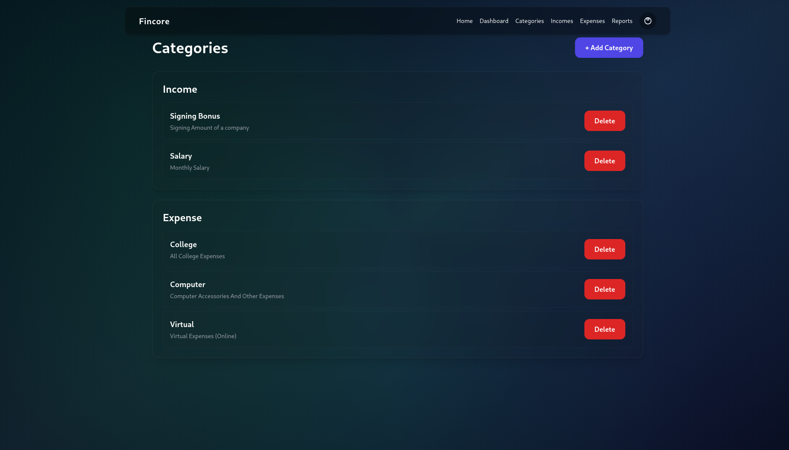
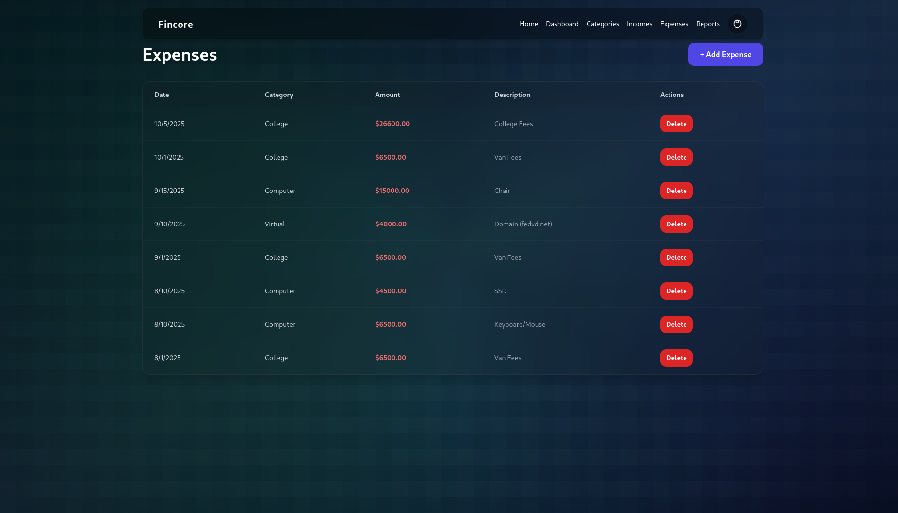
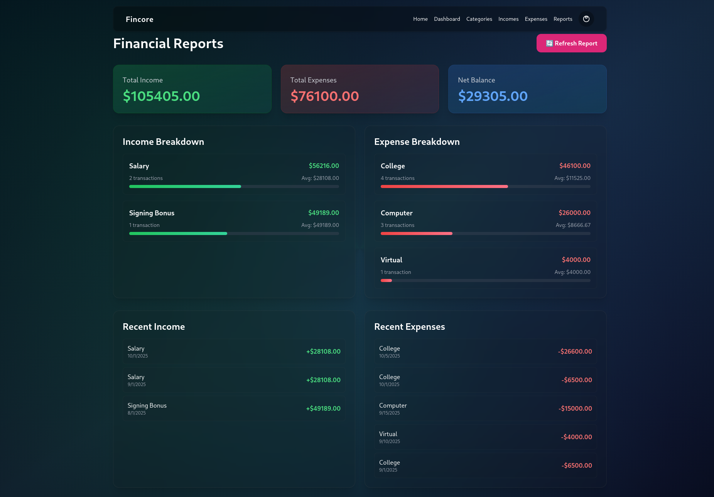

# FinCore - Project Overview

## Long Description

**FinCore** is a sophisticated personal finance management system designed to provide users with complete control over their financial data. Built on a robust full-stack architecture, FinCore goes beyond simple expense tracking by offering a comprehensive solution that includes income management, categorized financial tracking, and detailed reporting capabilities.

The platform is designed with modularity and extensibility at its core. While the current implementation focuses on fundamental finance tracking features, FinCore is being developed with the vision of becoming a complete Islamic wealth management system. The upcoming integration of **Khums** (Islamic one-fifth tax) and **Zakat** (Islamic charitable giving) calculations will make it one of the first open-source platforms to offer automated Islamic financial compliance alongside traditional personal finance management.

FinCore emphasizes data accuracy, user privacy, and actionable insights. Every transaction is categorized, timestamped, and linked to the user's account, ensuring complete data isolation and security. The hierarchical category system allows for flexible organization, while the real-time dashboard provides instant visibility into financial health through visual breakdowns and progress indicators.

Built using the [FullStack-Template](https://github.com/KazimFedxD/FullStack-Template), FinCore inherits a production-ready architecture featuring JWT authentication, Celery task queues for background processing, Redis caching, and a containerized deployment stack that ensures consistency across development and production environments.

## Problem Statement

### The Challenge
Traditional finance apps often face several critical issues:
- **Lack of Islamic Finance Support**: Most finance apps don't account for Islamic financial principles like Khums and Zakat calculations
- **Data Privacy Concerns**: Cloud-based solutions store sensitive financial data on third-party servers
- **Limited Customization**: Rigid category structures that don't adapt to individual needs
- **Poor Data Ownership**: Users can't easily export or self-host their financial data
- **Complexity**: Over-engineered interfaces that complicate simple tasks

### The Solution
FinCore addresses these challenges by:
- **Self-Hosting Capability**: Complete control over your data with Docker-based deployment
- **Islamic Finance Integration** (planned): Automated Khums and Zakat calculations based on financial data
- **Flexible Architecture**: Hierarchical categories and extensible data models
- **Open Source**: Full transparency and community-driven development
- **Modern UX**: Clean, intuitive interface built with React 19 and Tailwind CSS
- **API-First Design**: RESTful API enables integration with other tools and services

## Target Audience

### Primary Users
1. **Muslim Individuals & Families**: Seeking to manage finances while maintaining Islamic financial compliance
2. **Privacy-Conscious Users**: Those who prefer self-hosted solutions over cloud services
3. **Finance Enthusiasts**: People who want detailed insights and control over their financial data
4. **Developers**: Open-source contributors interested in fintech and Islamic finance

### Use Cases
- **Personal Budget Management**: Track daily income and expenses with category breakdowns
- **Islamic Financial Compliance**: Calculate Khums and Zakat obligations automatically (upcoming)
- **Financial Planning**: Analyze spending patterns and identify areas for improvement
- **Small Business Tracking**: Manage business income/expenses separate from personal finances
- **Educational Tool**: Learn about personal finance and Islamic economic principles

## What Makes FinCore Unique?

### 1. **Islamic Finance Integration** (In Development)
The first open-source platform to combine traditional personal finance tracking with Islamic financial principles, featuring automated Khums and Zakat calculations.

### 2. **Built on Production-Ready Template**
Leverages the FullStack-Template, ensuring:
- JWT authentication with automatic refresh
- Celery task queues for background processing
- Email verification system
- Redis caching for performance
- Containerized deployment

### 3. **Developer-Friendly Architecture**
- Clean separation of concerns (Django REST backend, React frontend)
- Well-documented API endpoints
- Docker Compose for one-command deployment
- Modular design for easy feature additions

### 4. **Data Ownership**
- Self-hosted deployment option
- Complete data export capabilities
- No vendor lock-in
- Open-source transparency

### 5. **Modern Tech Stack**
- React 19 with concurrent rendering
- Tailwind CSS for rapid UI development
- Framer Motion for smooth animations
- PostgreSQL for reliable data storage

## Visual Representation

### Dashboard Overview

*Real-time financial overview with income, expenses, and balance tracking*

### Category Management

*Hierarchical category system with root categories (Income/Expense) and subcategories*

### Income Tracking

*Detailed income tracking with dates, categories, and descriptions*

### Expense Tracking

*Comprehensive expense management with category-based organization*

### Reports & Analytics

*Detailed financial reports with category breakdowns and transaction history*

### Authentication Flow

*Secure JWT-based authentication with email verification*

## Current Development Status

**Phase**: Early Development - Core Features Complete (35% to full vision)

**Completed**:
- ✅ User authentication system (JWT + email verification)
- ✅ Category management (hierarchical structure)
- ✅ Income tracking (CRUD operations)
- ✅ Expense tracking (CRUD operations)
- ✅ Dashboard with financial overview
- ✅ Basic reporting system
- ✅ Responsive UI design
- ✅ Docker containerization

**In Progress**:
- 🔄 Advanced filtering and search
- 🔄 Performance optimization
- 🔄 Enhanced data validation

**Upcoming Features** (see future.md for detailed roadmap):
- 📅 Khums & Zakat calculations (Q1 2026)
- 📅 Visual charts and graphs (Q1 2026)
- 📅 Receipt storage with MinIO (Q2 2026)
- 📅 Export to PDF/Excel (Q2 2026)
- 📅 Multi-currency support (Q2 2026)
- 📅 Budget planning tools (Q3 2026)

## Project Philosophy

FinCore is built on the principles of:
- **Simplicity**: Clean interfaces and straightforward workflows
- **Privacy**: User data stays under user control
- **Accuracy**: Reliable calculations and data integrity
- **Openness**: Transparent development and community collaboration
- **Faith-Compatible**: Designed to support Islamic financial practices
- **Extensibility**: Architecture that grows with user needs
