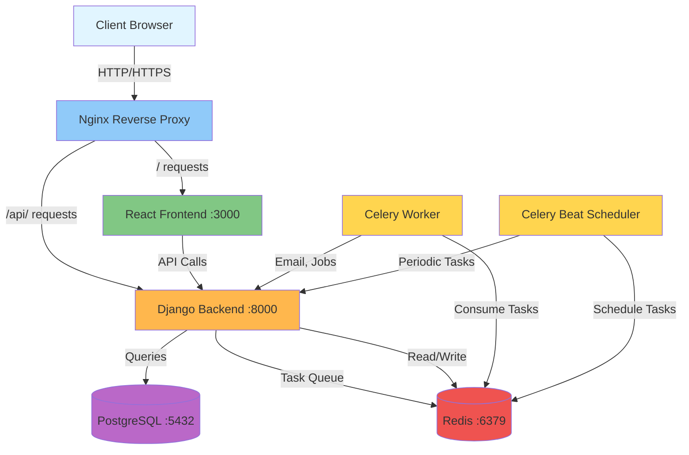
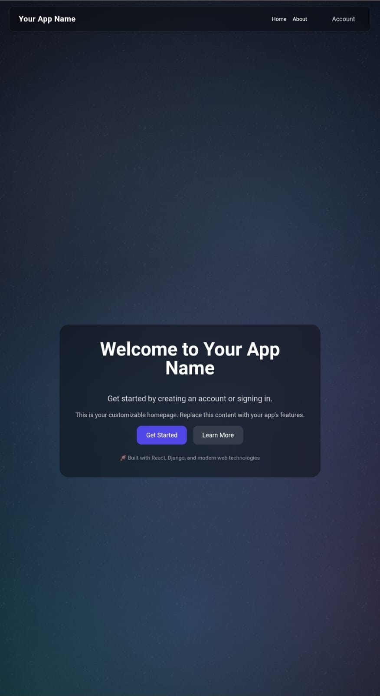
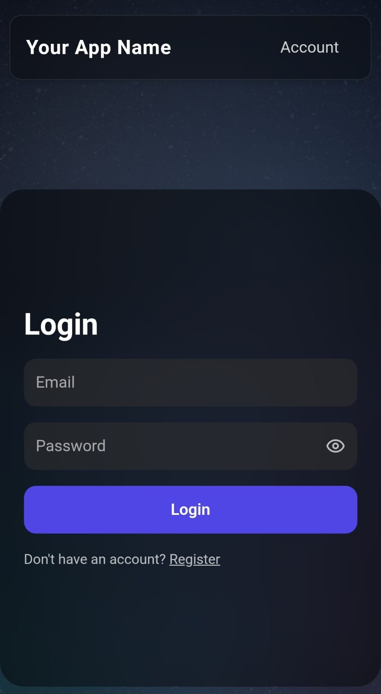
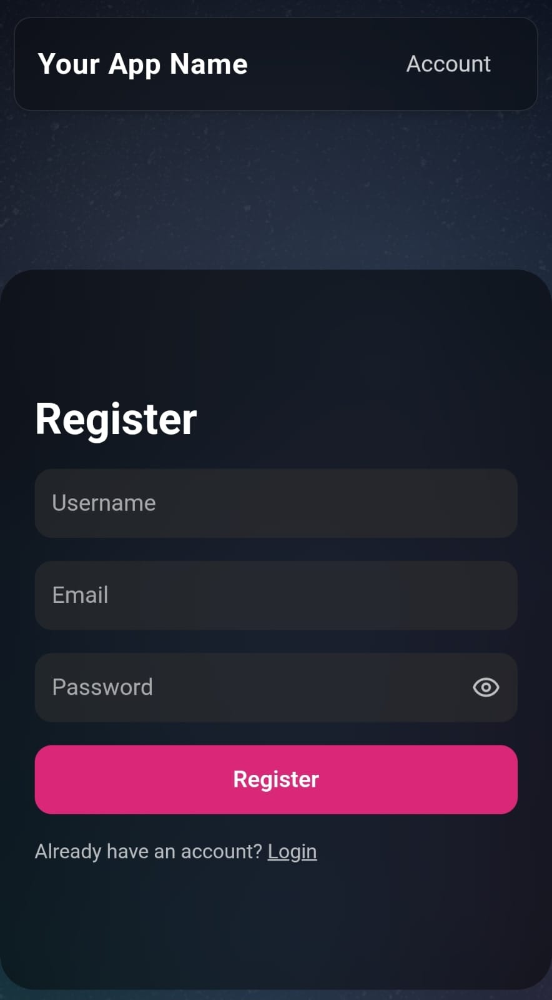
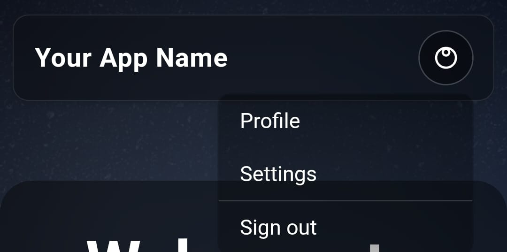
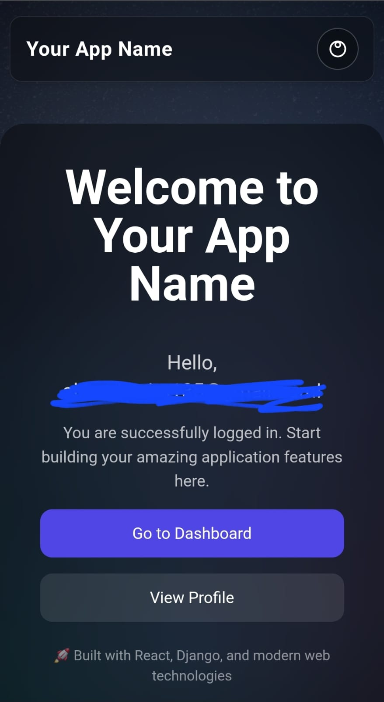
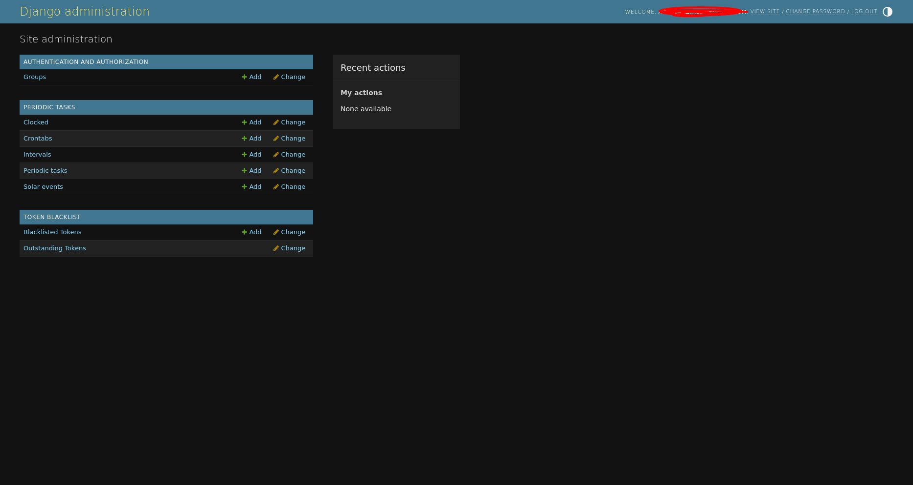

# Video & Media Assets

## Demo Video

### Main Project Demo
- **Platform**: YouTube
- **URL**: [Upload your demo video](https://youtube.com)
- **Duration**: 3-5 minutes recommended
- **Format**: 1920x1080 (Full HD)
- **Topics to Cover**:
  - Project overview and problem statement
  - Quick start (Docker setup)
  - Authentication flow (register, verify, login)
  - Dashboard/main interface
  - Key features demonstration
  - Architecture overview
  - Deployment process

**Status**: 📹 **TO BE CREATED** - See `admin_instructions.md` for details

---

## Feature Animations (GIFs)

### 1. Authentication Flow Animation
- **Filename**: `auth-flow.gif`
- **Location**: `.website/screenshots/auth-flow.gif`
- **Duration**: 10-15 seconds
- **Content**: User registration → email verification → login → dashboard
- **Status**: 📹 **TO BE CREATED**

---

### 2. Email Verification Animation
- **Filename**: `email-verification.gif`
- **Location**: `.website/screenshots/email-verification.gif`
- **Duration**: 5-10 seconds
- **Content**: Verification email received → token entry → success message
- **Status**: 📹 **TO BE CREATED**

---

### 3. Token Refresh Animation
- **Filename**: `token-refresh.gif`
- **Location**: `.website/screenshots/token-refresh.gif`
- **Duration**: 5-8 seconds
- **Content**: Access token expiration → automatic refresh → seamless continuation
- **Status**: 📹 **TO BE CREATED**

---

### 4. Responsive Design Animation
- **Filename**: `responsive-design.gif`
- **Location**: `.website/screenshots/responsive-design.gif`
- **Duration**: 5-10 seconds
- **Content**: Desktop → tablet → mobile view transitions
- **Status**: 📹 **TO BE CREATED**

---

### 5. Docker Startup Animation
- **Filename**: `docker-startup.gif`
- **Location**: `.website/screenshots/docker-startup.gif`
- **Duration**: 10-15 seconds
- **Content**: Terminal showing `docker-compose up -d` → services starting → successful deployment
- **Status**: 📹 **TO BE CREATED**

---

## Architecture Diagrams

### System Architecture Diagram
- **Filename**: `architecture-diagram.png`
- **Location**: `.website/screenshots/architecture-diagram.png`
- **Format**: PNG (high resolution)
- **Content**: Complete system architecture showing all 7 services and their relationships
- **Tool**: draw.io, Lucidchart, or Mermaid
- **Status**: 📊 **TO BE CREATED** - See `admin_instructions.md`

**Text-based Alternative** (Mermaid):


---

### Database Schema Diagram
- **Filename**: `database-schema.png`
- **Location**: `.website/screenshots/database-schema.png`
- **Format**: PNG or ER diagram
- **Content**: User model, JWT tokens, relationships
- **Tool**: dbdiagram.io, draw.io, or pgAdmin
- **Status**: 📊 **TO BE CREATED**

**Text-based Alternative**:
```
┌─────────────────────────────┐
│     usermanagement_authacc   │
├─────────────────────────────┤
│ id (PK)                     │
│ email (UNIQUE)              │
│ password (hashed)           │
│ verified (BOOLEAN)          │
│ created_at                  │
│ updated_at                  │
└─────────────────────────────┘
       │
       │ 1:N
       ▼
┌─────────────────────────────┐
│ token_blacklist_outstanding │
├─────────────────────────────┤
│ id (PK)                     │
│ user_id (FK)                │
│ jti (UNIQUE)                │
│ token (TEXT)                │
│ created_at                  │
│ expires_at                  │
└─────────────────────────────┘
```

---

### Request Flow Diagram
- **Filename**: `request-flow.png`
- **Location**: `.website/screenshots/request-flow.png`
- **Format**: PNG sequence diagram
- **Content**: Browser → Nginx → Backend → Database → Response
- **Status**: 📊 **TO BE CREATED**

**Already documented in** `architecture.md` (text-based)

---

## Screenshots Catalog

### Desktop Screenshots

#### 1. Homepage/Landing Page ✅
- **Filename**: `homepage.png`
- **Location**: `.website/screenshots/homepage.png`
- **Content**: Landing page with hero section, glassmorphism background
- **Status**: ✅ **CAPTURED**


*Landing page showcasing the modern glassmorphism design with animated gradient background*

---

#### 2. Login Form ✅
- **Filename**: `login.png`
- **Location**: `.website/screenshots/login.png`
- **Content**: Login form with email and password fields, styled with glass effect
- **Status**: ✅ **CAPTURED**


*Login interface with glassmorphism design and smooth animations*

---

#### 3. Registration Form ✅
- **Filename**: `register.png`
- **Location**: `.website/screenshots/register.png`
- **Content**: Registration form with validation
- **Status**: ✅ **CAPTURED**


*User registration form with real-time validation*

---

#### 4. Email Verification Page ✅
- **Filename**: `verification.png`
- **Location**: `.website/screenshots/verification.png`
- **Content**: Verification token entry page
- **Status**: ✅ **CAPTURED**


*Email verification page with 6-character token input*

---

#### 5. Dashboard (Authenticated View) ✅
- **Filename**: `dashboard.png`
- **Location**: `.website/screenshots/dashboard.png`
- **Content**: Main authenticated user interface
- **Status**: ✅ **CAPTURED**


*Authenticated user dashboard with personalized greeting*

---

### Mobile Screenshots

#### 1. Mobile Homepage ✅
- **Filename**: `mobile-homepage.jpeg`
- **Location**: `.website/screenshots/mobile-homepage.jpeg`
- **Content**: Mobile-responsive landing page
- **Status**: ✅ **CAPTURED**


*Mobile homepage with responsive design*

---

#### 2. Mobile Login ✅
- **Filename**: `mobile-login.jpeg`
- **Location**: `.website/screenshots/mobile-login.jpeg`
- **Content**: Mobile login form
- **Status**: ✅ **CAPTURED**


*Mobile-optimized login interface*

---

#### 3. Mobile Register ✅
- **Filename**: `mobile-register.jpeg`
- **Location**: `.website/screenshots/mobile-register.jpeg`
- **Content**: Mobile registration form
- **Status**: ✅ **CAPTURED**


*Mobile registration form with touch-friendly inputs*

---

#### 4. Mobile Navigation ✅
- **Filename**: `mobile-navbar.jpeg`
- **Location**: `.website/screenshots/mobile-navbar.jpeg`
- **Content**: Mobile navigation menu
- **Status**: ✅ **CAPTURED**


*Mobile navigation with hamburger menu*

---

#### 5. Mobile Dashboard ✅
- **Filename**: `mobile-dashboard.jpeg`
- **Location**: `.website/screenshots/mobile-dashboard.jpeg`
- **Content**: Mobile dashboard view
- **Status**: ✅ **CAPTURED**


*Mobile dashboard with responsive layout*

---

### Backend/Admin Screenshots

#### 1. Django Admin Panel ✅
- **Filename**: `admin-panel.png`
- **Location**: `.website/screenshots/admin-panel.png`
- **Content**: Django admin interface showing user management
- **Status**: ✅ **CAPTURED**


*Django admin interface for user and system management*

---

#### 2. Celery Flower Dashboard (if using)
- **Filename**: `celery-flower.png`
- **Location**: `.website/screenshots/celery-flower.png`
- **Content**: Celery task monitoring dashboard
- **Status**: 📸 **TO BE CAPTURED** (optional)

---

#### 3. Docker Desktop Dashboard
- **Filename**: `docker-dashboard.png`
- **Location**: `.website/screenshots/docker-dashboard.png`
- **Content**: All containers running in Docker Desktop
- **Status**: 📸 **TO BE CAPTURED** (optional)

---

## Email Screenshots

### Verification Email
- **Filename**: `email-verification-sample.png`
- **Location**: `.website/screenshots/email-verification-sample.png`
- **Content**: Screenshot of verification email received
- **Status**: 📸 **TO BE CAPTURED**

**Template Location**: `backend/email_templates/verify_email.html`

---

## Presentation Materials

### Slide Deck
- **Filename**: `presentation.pdf`
- **Location**: `.website/presentation.pdf`
- **Format**: PDF (PowerPoint, Google Slides, or Keynote exported)
- **Content**:
  - Title slide
  - Problem statement
  - Solution overview
  - Key features (4-6 slides)
  - Architecture diagram
  - Tech stack
  - Demo/screenshots
  - Future roadmap
  - Q&A / Contact
- **Status**: 📊 **TO BE CREATED** (optional, for presentations)

---

### One-Pager
- **Filename**: `one-pager.pdf`
- **Location**: `.website/one-pager.pdf`
- **Format**: PDF infographic
- **Content**: Visual summary of project (1 page)
- **Status**: 📊 **TO BE CREATED** (optional)

---

## Media Creation Guidelines

### Screenshot Guidelines

1. **Resolution**: Minimum 1920x1080 for desktop, 375x812 for mobile
2. **Format**: PNG for UI screenshots, JPEG for photos
3. **Browser**: Use Chrome for consistency
4. **Data**: Use realistic (not lorem ipsum) but anonymized data
5. **Clean UI**: Close unnecessary tabs, hide personal info
6. **Consistent Theme**: All screenshots should match branding

### GIF Guidelines

1. **Duration**: 5-15 seconds maximum
2. **File Size**: Keep under 5MB (optimize with tools like EZGIF)
3. **Frame Rate**: 15-24 fps
4. **Resolution**: 1280x720 or smaller for web performance
5. **Loop**: Most should loop seamlessly

### Video Guidelines

1. **Resolution**: 1920x1080 (Full HD)
2. **Format**: MP4 (H.264 codec)
3. **Duration**: 3-5 minutes for main demo, 30-60s for feature highlights
4. **Audio**: Clear narration or background music (royalty-free)
5. **Subtitles**: Add captions for accessibility
6. **Branding**: Intro/outro with project name

---

## Tools for Media Creation

### Screenshot Tools
- **macOS**: Cmd+Shift+4, Cmd+Shift+5
- **Windows**: Snipping Tool, Win+Shift+S
- **Linux**: GNOME Screenshot, Shutter
- **Browser Extension**: Awesome Screenshot, Nimbus Screenshot

### GIF Recording
- **LICEcap** (Windows/macOS) - Free
- **ScreenToGif** (Windows) - Free, powerful
- **GIPHY Capture** (macOS) - Free, easy
- **Kap** (macOS) - Free, open source

### Video Recording
- **OBS Studio** (All platforms) - Free, professional
- **Loom** (Web) - Free tier, easy screen recording
- **ScreenFlow** (macOS) - Paid, excellent editing
- **Camtasia** (Windows/macOS) - Paid, all-in-one

### Diagram Tools
- **draw.io** - Free, web-based
- **Lucidchart** - Freemium, professional
- **Mermaid** - Free, text-based (code)
- **Excalidraw** - Free, hand-drawn style
- **dbdiagram.io** - Free, database diagrams

### Image Optimization
- **TinyPNG** - Compress PNG/JPEG
- **ImageOptim** (macOS) - Batch compression
- **EZGIF** - GIF optimization and editing

---

## Media Storage

All media files should be stored in:
- **Screenshots**: `.website/screenshots/`
- **Videos**: Upload to YouTube, link in documentation
- **Large files**: Use Git LFS or external hosting

**Note**: Do not commit large binary files (>1MB) directly to Git repository.

---

## Embedding Media in Documentation

### Images
```markdown

*Caption describing the image*
```

### GIFs
```markdown

*Animation showing X feature in action*
```

### Videos
```markdown
[](https://www.youtube.com/watch?v=VIDEO_ID)
*Click to watch demo video on YouTube*
```

---

## Accessibility Considerations

- All images should have descriptive alt text
- Videos should have captions/subtitles
- Diagrams should have text descriptions
- Ensure good color contrast in diagrams
- Provide text alternatives for all visual content

---

## Quick Reference: Media Status

### ✅ Completed (11 screenshots)
- [x] Homepage screenshot (desktop)
- [x] Login screenshot (desktop)
- [x] Register screenshot (desktop)
- [x] Verification screenshot (desktop)
- [x] Dashboard screenshot (desktop)
- [x] Admin panel screenshot (desktop)
- [x] Mobile homepage
- [x] Mobile login
- [x] Mobile register
- [x] Mobile navigation
- [x] Mobile dashboard

### 📹 Still Needed (High Priority)
- [ ] Main demo video (3-5 min)
- [ ] Architecture diagram
- [ ] Authentication flow GIF (optional)
- [ ] Email verification screenshot (optional)

### 📹 Optional Enhancements
- [ ] Docker startup GIF
- [ ] Responsive design animation
- [ ] Database schema diagram
- [ ] Feature-specific GIFs

---

**For detailed instructions on creating these assets, see** `admin_instructions.md`

**Last Updated**: November 2025  
**Version**: 1.0.0
