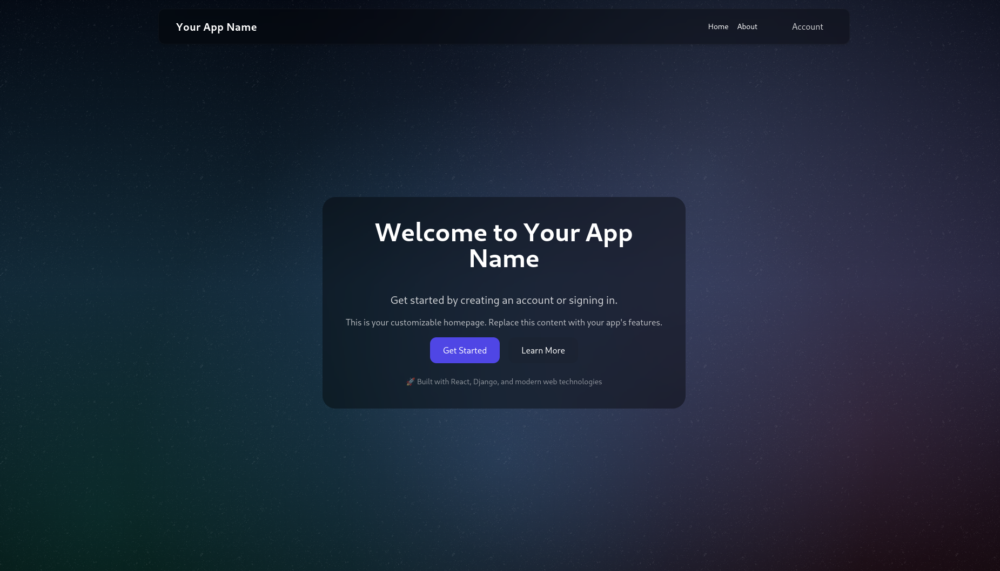
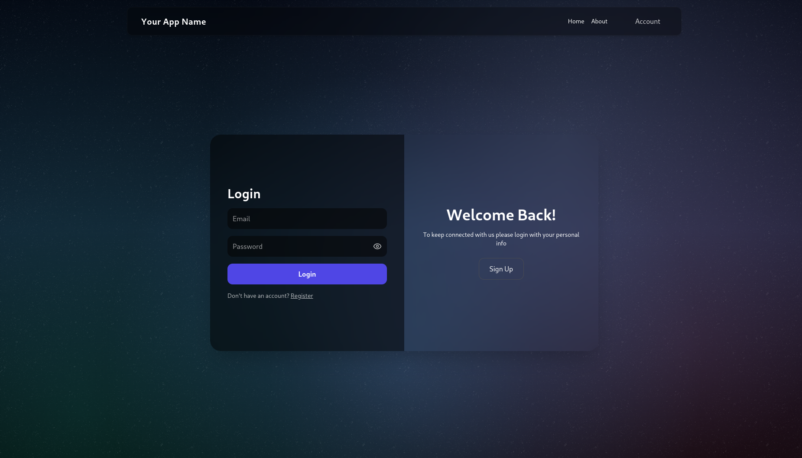
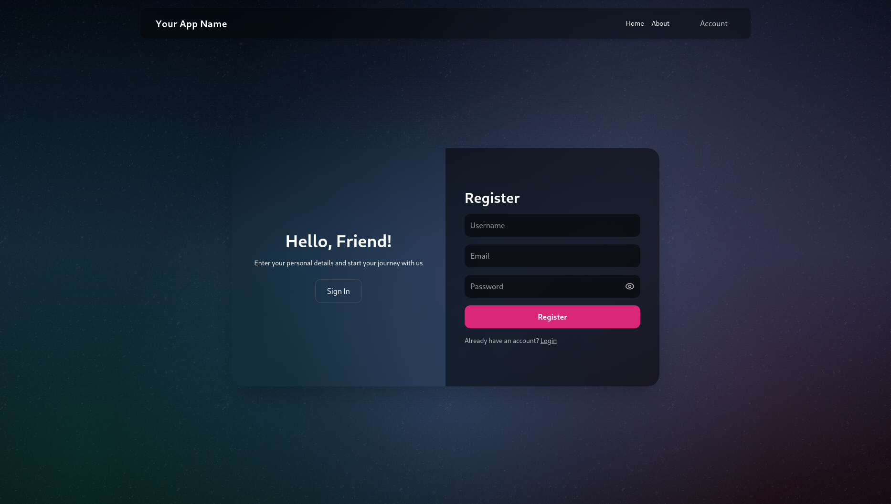
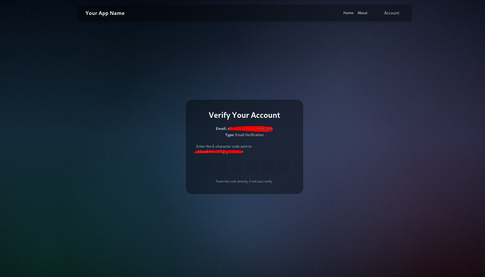
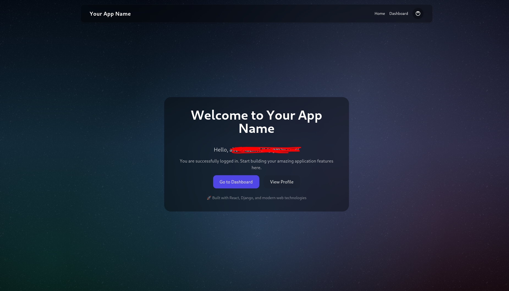

# Project Overview

## Full-Stack Web Application Template

This is a comprehensive, production-ready full-stack web application template designed to accelerate development by providing a robust, scalable foundation with modern best practices. The template combines React 19's latest features with Django 5.2's powerful backend capabilities, all orchestrated through Docker for seamless deployment across any platform.

The project serves as a starting point for building modern web applications that require secure authentication, real-time task processing, and a beautiful user interface. It eliminates weeks of boilerplate setup, allowing developers to focus on building features rather than configuring infrastructure. With complete containerization, the entire application stack—frontend, backend, database, cache, and reverse proxy—can be deployed with a single command.

Built with scalability in mind, this template includes Celery for asynchronous task processing, Redis for high-performance caching and message brokering, and PostgreSQL for reliable data persistence. The authentication system implements industry-standard JWT tokens with httpOnly cookies for enhanced security, automatic token refresh, and comprehensive email verification workflows.

## Problem Statement

Starting a new full-stack web application involves significant overhead:

- **Configuration Complexity**: Setting up Django, React, PostgreSQL, Redis, and Nginx requires deep knowledge of each technology and their integration points
- **Authentication Boilerplate**: Implementing secure JWT authentication with refresh tokens, httpOnly cookies, and email verification is time-consuming and error-prone
- **Deployment Challenges**: Coordinating multiple services (database, backend, frontend, cache, proxy) across development and production environments
- **Development Environment**: Creating a consistent development environment across team members with different operating systems
- **Security Concerns**: Properly securing API endpoints, managing CORS, implementing CSRF protection, and handling sensitive credentials
- **Task Management**: Setting up background job processing for emails, scheduled tasks, and long-running operations

This template solves all these problems by providing a battle-tested, pre-configured solution that follows industry best practices.

## Target Audience

This template is ideal for:

- **Full-Stack Developers** building modern web applications from scratch
- **Startups** needing a rapid, reliable foundation for their MVP
- **Development Teams** requiring a standardized tech stack across projects
- **Students & Learners** studying full-stack development patterns and architecture
- **Freelancers** looking to accelerate project delivery with proven templates
- **Companies** establishing internal development standards and best practices

## What Makes This Project Unique

### 🔒 Security-First Design
- HttpOnly cookies prevent XSS token theft
- Automatic token refresh ensures seamless user experience
- JWT blacklisting prevents token reuse after logout
- Email verification ensures valid user accounts
- CORS and CSRF protection configured correctly

### 🐳 True Containerization
- Every component runs in Docker—no "it works on my machine" issues
- Hot-reload in development for both frontend and backend
- Production-optimized builds with multi-stage Dockerfiles
- Volume management for persistent data
- Health checks ensure services start in correct order

### ⚡ Async Task Processing
- Celery workers handle background tasks (emails, reports, etc.)
- Celery Beat scheduler for periodic tasks (cleanup, notifications)
- Redis as message broker for high throughput
- Separate containers for workers and beat scheduler

### 🎨 Modern Frontend Architecture
- React 19 with latest hooks and concurrent features
- Context API for global state management
- Custom hooks for error handling and authentication
- Persistent state across page refreshes
- Beautiful glassmorphism UI with Tailwind CSS and Framer Motion

### 🔧 Developer Experience
- Single command to start entire stack (`docker-compose up -d`)
- Environment variable management with `.env` files
- Comprehensive error handling and logging
- Clear project structure and separation of concerns
- Extensive documentation and code comments

### 📊 Production-Ready Features
- Nginx reverse proxy for optimized routing
- Database migrations managed through Django ORM
- Custom user model with email-based authentication
- Middleware for cookie-based JWT authentication
- API versioning and structured endpoints

## Visual Representation

### Application Screenshots

*Modern landing page with glassmorphism design and smooth animations*

*Secure login interface with real-time validation and error handling*

*User registration with password strength indicators and email validation*

*Email verification page with token-based confirmation*

*Main application dashboard (customizable for your use case)*

### Architecture Diagram

*Complete system architecture showing service interactions*

## Use Cases

This template can be adapted for:

- SaaS applications requiring user authentication
- E-commerce platforms with user accounts
- Project management tools
- Social networking applications
- Content management systems
- API-driven mobile app backends
- Internal business applications
- Educational platforms
- Booking and reservation systems

## Key Differentiators

| Feature | This Template | Typical Alternatives |
|---------|---------------|---------------------|
| Authentication | JWT + HttpOnly Cookies + Email Verification | Often JWT in localStorage (insecure) |
| Containerization | Complete Docker setup with hot-reload | Manual setup or partial containerization |
| Task Processing | Celery + Beat + Redis pre-configured | Often missing or DIY setup |
| Frontend State | Persistent context with auto-recovery | Lost on refresh |
| Email System | Template-based HTML emails with Celery | Basic email or no email system |
| Production Ready | Nginx, environment configs, health checks | Development-only setups |
| Documentation | Comprehensive docs for all components | Minimal or missing documentation |

## Technical Highlights

- **Custom Authentication Middleware**: Seamlessly integrates JWT cookies with Django REST Framework
- **Token Management**: Automatic refresh, blacklisting, and expiration handling
- **Email Template System**: Reusable HTML email templates with variable substitution
- **State Preservation**: Frontend state persists across page refreshes and navigation
- **Error Boundaries**: Comprehensive error handling on both frontend and backend
- **API Client**: Centralized API client with retry logic, timeouts, and error handling
- **Database Design**: Flexible schema with custom user model and migrations
- **Encryption Utilities**: Built-in encryption for sensitive data storage
