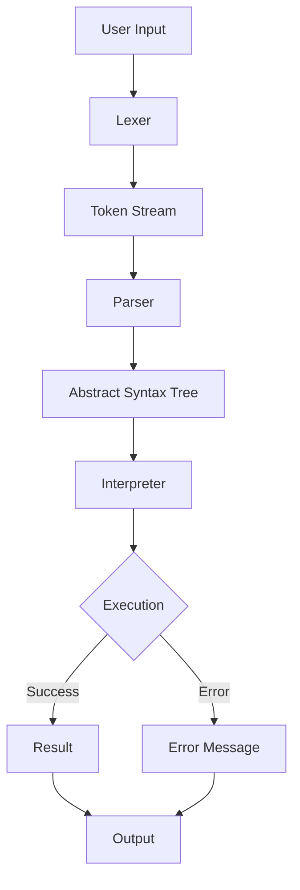

# FxPy Media & Visual Assets

This document catalogs video, image, and diagram assets for FxPy.

---

## Demo Videos

### Main Project Demo

- **YouTube:** [FxPy Language Demo](placeholder)
- **Duration:** 5-7 minutes
- **Topics Covered:**
  - Language overview and motivation
  - Interactive REPL demonstration
  - Script execution examples
  - Module import system
  - Key features (functions, loops, recursion)
  - Error handling showcase

**Status:** 📝 To be created

---

### Feature Walkthroughs

#### 1. Getting Started with FxPy
- **Duration:** 3 minutes
- **Content:** Installation, first program, REPL basics

#### 2. Functions and Modules
- **Duration:** 4 minutes
- **Content:** Function definitions, imports, module creation

#### 3. Control Flow and Loops
- **Duration:** 3 minutes
- **Content:** If/else, for loops, while loops, recursion

**Status:** 📝 To be created

---

## Screenshots

### Desktop - REPL Interface

**Required Screenshots:**

1. **`repl-startup.png`** ✅
   - Location: `.website/screenshots/repl-startup.png`
   - Content: Clean REPL start screen showing prompt
   - Status: ✅ **Captured**

2. **`repl-interactive.png`** ✅
   - Location: `.website/screenshots/repl-interactive.png`
   - Content: REPL session with variable assignments, function definitions
   - Status: ✅ **Captured**

3. **`repl-error.png`** ✅
   - Location: `.website/screenshots/repl-error.png`
   - Content: Error message with visual arrows pointing to mistake
   - Status: ✅ **Captured**

---

### Desktop - Script Execution

4. **`script-execution.png`** ✅
   - Location: `.website/screenshots/script-execution.png`
   - Content: Running a `.fx` file from terminal
   - Status: ✅ **Captured**

---

### Desktop - Code Examples

5. **`code-functions.png`** ✅
   - Location: `.website/screenshots/code-functions.png`
   - Content: `.fx` file open in editor showing function definitions
   - Status: ✅ **Captured**

6. **`import.png`** ✅
   - Location: `.website/screenshots/import.png`
   - Content: Basic import statement example
   - Status: ✅ **Captured**

7. **`from-import.png`** ✅
   - Location: `.website/screenshots/from-import.png`
   - Content: From-import syntax demonstration
   - Status: ✅ **Captured**

---

## GIF Animations

### Feature Demonstrations

#### 1. Interactive REPL Session

- **Filename:** `repl-demo.gif`
- **Location:** `.website/screenshots/repl-demo.gif`
- **Duration:** 10-15 seconds
- **Content:**
  - Type commands in REPL
  - Show real-time evaluation
  - Demonstrate immediate feedback
- **Status:** ❌ Not created yet

---

#### 2. Error Reporting

- **Filename:** `error-demo.gif`
- **Location:** `.website/screenshots/error-demo.gif`
- **Duration:** 5-10 seconds
- **Content:**
  - Trigger syntax error
  - Show visual arrow indicator
  - Display helpful error message
- **Status:** ❌ Not created yet

---

#### 3. Function Execution

- **Filename:** `function-demo.gif`
- **Location:** `.website/screenshots/function-demo.gif`
- **Duration:** 10 seconds
- **Content:**
  - Define a function in REPL
  - Call it with different arguments
  - Show results
- **Status:** ❌ Not created yet

---

#### 4. Module Import

- **Filename:** `import-demo.gif`
- **Location:** `.website/screenshots/import-demo.gif`
- **Duration:** 10 seconds
- **Content:**
  - Import a module
  - Use imported functions
  - Show dot notation access
- **Status:** ❌ Not created yet

---

## Architecture Diagrams

### System Architecture

**Text-Based Diagram (Included in documentation):**

```
Source Code (.fx)
       ↓
┌──────────────┐
│    LEXER     │  Tokenization
│  (lexer.py)  │  • String → Tokens
└──────┬───────┘  • Position tracking
       │
       ▼
┌──────────────┐
│    PARSER    │  AST Generation
│(fxparser.py) │  • Tokens → AST
└──────┬───────┘  • Syntax validation
       │
       ▼
┌──────────────┐
│ INTERPRETER  │  Execution
│(interpreter  │  • AST → Results
│    .py)      │  • Symbol tables
└──────┬───────┘  • Runtime errors
       │
       ▼
   Output/Errors
```

**Visual Diagram:**
- **Filename:** `architecture-diagram.png`
- **Location:** `.website/screenshots/architecture-diagram.png`
- **Tool:** draw.io or Mermaid
- **Content:** Detailed component interaction diagram
- **Status:** ❌ Not created yet

---

### Data Flow Diagram

**Mermaid Diagram (can be embedded in markdown):**



**Status:** ✅ Can be used in markdown directly

---

### Module System Diagram

**Filename:** `module-system.png`
**Location:** `.website/screenshots/module-system.png`
**Content:**
- Show how imports resolve paths
- Display symbol table population
- Illustrate module caching (future)

**Status:** ❌ Not created yet

---

## Code Syntax Highlighting

All code examples in documentation use **JavaScript** syntax highlighting for `.fx` files:

````markdown
```javascript
fex factorial(n):
    if n == 0: return 1 end
    return n * factorial(n - 1)
end
```
````

**Reason:** FxPy syntax is similar to JavaScript/Python hybrid.

---

## Presentation Materials

### Slide Deck

**Format:** PDF or PowerPoint
**Filename:** `fxpy-presentation.pdf`
**Location:** `.website/fxpy-presentation.pdf`

**Slide Outline:**
1. Title: FxPy - Custom Programming Language
2. Motivation: Why build a language?
3. Architecture: Three-phase interpretation
4. Features: Dynamic typing, functions, modules
5. Demo: Live REPL session
6. Code Examples: Syntax showcase
7. Technical Achievements: Stats and metrics
8. Future Plans: Roadmap
9. Conclusion: Call to action (star repo, contribute)

**Status:** ❌ Not created yet

---

### Infographic

**Visual Summary:**
- Language features at a glance
- Performance metrics
- Lines of code breakdown
- Comparison with other educational languages

**Status:** 📝 Concept only

---

## Recording Tools Recommendations

### Screen Recording

- **OBS Studio** (Free, cross-platform)
- **Loom** (Easy, web-based)
- **QuickTime** (macOS built-in)
- **Windows Game Bar** (Windows built-in)

### GIF Creation

- **LICEcap** (Lightweight, cross-platform)
- **ScreenToGif** (Windows, powerful)
- **Peek** (Linux, simple)

### Diagram Creation

- **draw.io** (Free, web-based)
- **Excalidraw** (Hand-drawn style)
- **Mermaid** (Text-based, embeds in markdown)
- **Lucidchart** (Professional, paid)

---

## Screenshot Guidelines

### Terminal Screenshots

1. **Use consistent theme:**
   - Dark background (easier on eyes)
   - Readable font size (14pt+)
   - Syntax highlighting enabled

2. **Keep it clean:**
   - Clear prompt (`FxPy >`)
   - No unnecessary clutter
   - Focus on relevant content

3. **Resolution:**
   - Minimum 1920x1080
   - Export as PNG (lossless)

4. **Content:**
   - Show realistic examples
   - Use meaningful variable names
   - Demonstrate actual features

---

## Video Guidelines

### Recording Best Practices

1. **Prepare script:**
   - Plan what to demonstrate
   - Practice commands beforehand
   - Keep it concise (5-7 minutes max)

2. **Audio quality:**
   - Use good microphone
   - Minimize background noise
   - Speak clearly and at moderate pace

3. **Visual clarity:**
   - Large terminal font
   - High contrast colors
   - Slow down typing if needed

4. **Editing:**
   - Cut out mistakes
   - Add captions for clarity
   - Include intro/outro slides

---

## Media Checklist

### Essential Media

- [ ] REPL startup screenshot
- [ ] Interactive REPL session screenshot
- [ ] Error message screenshot
- [ ] Script execution screenshot
- [ ] REPL demo GIF
- [ ] Architecture diagram
- [ ] Demo video (5 minutes)

### Optional Media

- [ ] Code editor screenshots
- [ ] Module import demonstration
- [ ] Function execution GIF
- [ ] Presentation slides
- [ ] Feature comparison infographic

---

## Usage in Documentation

### Where Screenshots Are Referenced

1. **overview.md** - Screenshots section (placeholders)
2. **README.md** - Example outputs (can add)
3. **architecture.md** - Architecture diagram
4. **features.md** - Feature demonstrations

### Where Videos Are Referenced

1. **overview.md** - Demo video link
2. **media.md** - Full media catalog (this file)
3. **setup.md** - Tutorial video (future)

---

## Licensing

All media assets created for FxPy should be:
- ✅ Original content (no copyright issues)
- ✅ Free to use/modify (MIT or CC0)
- ✅ No personal information visible
- ✅ No proprietary software in screenshots

---

## Directory Structure

After all media is created:

```
.website/
├── screenshots/
│   ├── repl-startup.png
│   ├── repl-interactive.png
│   ├── repl-error.png
│   ├── script-execution.png
│   ├── script-output.png
│   ├── code-functions.png
│   ├── code-imports.png
│   ├── repl-demo.gif
│   ├── error-demo.gif
│   ├── function-demo.gif
│   ├── import-demo.gif
│   ├── architecture-diagram.png
│   └── module-system.png
├── fxpy-presentation.pdf
└── README.md (screenshot instructions)
```

---

## Next Steps

1. Create `.website/screenshots/` directory
2. Record demo video
3. Capture essential screenshots
4. Create GIF animations
5. Draw architecture diagram
6. Update documentation with actual media links

---

**Last Updated:** November 19, 2025

*Media assets will be added as they are created.*
