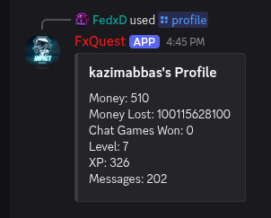
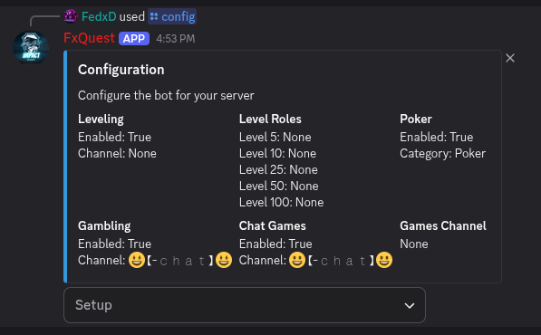

# Project Overview

FxQuest is an advanced, production-ready Discord bot designed to transform Discord servers into interactive gaming hubs with comprehensive engagement systems. Built with Python 3.12+ and Discord.py 2.0+, FxQuest offers a rich ecosystem of **12 major features** including 8+ interactive multiplayer games, a robust economy system with virtual currency, an XP-based leveling mechanism with role rewards, and unique Minecraft-inspired features including mining, crafting, and inventory management.

The bot leverages modern Discord UI components (buttons, select menus, modals) to deliver an intuitive, interactive user experience. With its async/await architecture, FxQuest handles concurrent gameplay across multiple servers efficiently, supporting unlimited simultaneous game sessions. The modular cog-based structure allows for easy maintenance and feature expansion, while the custom database abstraction layer provides seamless SQLite integration for persistent data storage.

FxQuest stands out with its comprehensive server customization options, allowing administrators to configure features per-channel, toggle systems on/off, and create tailored experiences for their communities. The bot includes automated chat games that reward active members, an interactive help system with command discovery, a user feedback system for community input, and advanced owner controls for bot management. Whether you're running a small community or a large gaming server, FxQuest provides the tools to boost engagement, reward participation, and create memorable interactive experiences.

## Problem Statement

Discord servers often struggle with member engagement and retention. While Discord provides excellent communication tools, it lacks native features for:
- **Interactive Entertainment**: No built-in games or activities to keep members engaged
- **Progression Systems**: No way to reward long-term participation and activity
- **Economy Mechanics**: No virtual currency or reward systems
- **Community Gamification**: Limited tools to incentivize participation and interaction

Server owners typically need to rely on multiple bots, each with different command structures and interfaces, leading to fragmented user experiences and administrative complexity.

## Solution

FxQuest solves these problems by providing:
- **All-in-One Platform**: Games, economy, leveling, and server management in a single bot
- **Engagement Mechanics**: Automated chat games and rewards for participation
- **Progression System**: XP-based leveling with customizable role rewards
- **Interactive Games**: 8+ fully-featured multiplayer games with modern UI
- **Flexible Configuration**: Per-server customization to match community needs
- **Persistent Progress**: Database-backed profiles tracking stats, currency, and achievements

## Target Audience

- **Discord Server Owners**: Looking to increase engagement and retention
- **Gaming Communities**: Wanting interactive features beyond voice chat
- **Social Servers**: Seeking ways to reward active members
- **Developer Communities**: Interested in gamification and progression systems
- **Educational Servers**: Using gamification for learning incentives

## Unique Value Proposition

Unlike generic Discord bots, FxQuest offers:
1. **True Multiplayer Games**: Not just simple commands, but full-featured games with turn-based mechanics
2. **Minecraft Integration**: Unique mining and crafting system inspired by Minecraft
3. **Custom Database Layer**: Efficient ORM-like methods for rapid feature development
4. **Modern UI**: Discord's latest UI components for intuitive interactions
5. **Comprehensive Customization**: Per-server, per-channel configuration
6. **Open Architecture**: Easy to extend with new games and features

## Visual Representation

*FxQuest setup interface with interactive buttons*

*Multi-player UNO game with Discord select menus*

*User profile showing level, XP, balance, and stats*

*Texas Hold'em poker with betting rounds*

*Minecraft-inspired mining and inventory*

*Admin configuration panel for server customization*
