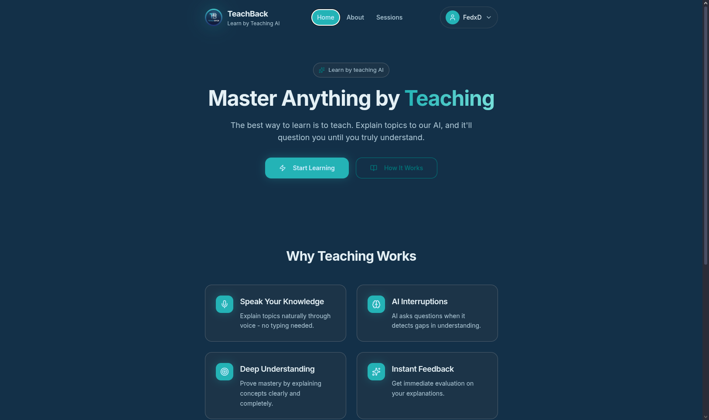
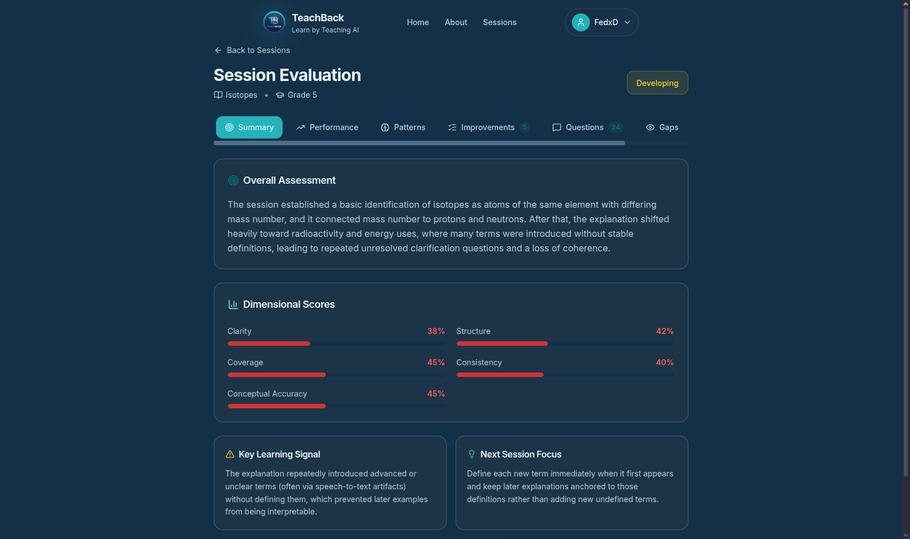

# TeachBack — Project Overview

## What is TeachBack?

TeachBack is a revolutionary learning platform built on a simple but powerful principle: **You learn best by teaching.**

Unlike traditional learning platforms where AI teaches you, TeachBack reverses the roles. You become the teacher, explaining topics in your own words while an AI student listens, asks questions, and challenges your understanding. This active explanation approach forces you to organize your thoughts, identify gaps in your knowledge, and truly internalize what you're learning.

The platform is designed for voice-first interaction. You speak naturally, explaining concepts as if teaching a curious student. The AI doesn't just passively listen—it actively engages, interrupting when something is unclear, asking follow-up questions, and pushing you to think deeper. At the end of each session, you receive a detailed evaluation covering clarity, structure, topic coverage, and overall understanding.

TeachBack transforms learning from passive consumption into active construction of knowledge. Whether you're a student preparing for exams, a professional learning new skills, or anyone who wants to truly understand a topic, TeachBack provides a unique and effective learning experience.

## Problem Statement

Traditional learning methods suffer from several fundamental problems:

### The Illusion of Understanding
Most learners fall into the trap of thinking they understand something after reading or watching content. This "familiarity" is often mistaken for true comprehension. When asked to explain the concept without notes, many realize they don't actually understand it.

### Passive Consumption
Videos, lectures, and textbooks encourage passive consumption. The learner receives information but rarely processes it deeply. Without active engagement, knowledge doesn't stick.

### Delayed Feedback
Traditional testing provides feedback days or weeks after learning. By then, incorrect mental models have already solidified, making them harder to correct.

### One-Size-Fits-All
Standard learning paths can't adapt to individual understanding gaps. Everyone follows the same curriculum regardless of their existing knowledge or specific weaknesses.

## The TeachBack Solution

TeachBack addresses these problems through the "protégé effect" — the proven phenomenon where teaching forces deeper understanding:

1. **Active Explanation**: You must verbalize your understanding, exposing gaps you didn't know existed
2. **Real-Time Feedback**: The AI immediately challenges unclear explanations
3. **Personalized Learning**: The AI adapts questions based on YOUR explanation, not a generic curriculum
4. **Measurable Progress**: Detailed evaluations show exactly where your understanding is strong or weak

## Target Audience

- **Students** — Preparing for exams, understanding complex topics, building long-term retention
- **Professionals** — Learning new skills, deepening expertise, preparing for interviews
- **Educators** — Understanding student perspectives, testing teaching materials
- **Lifelong Learners** — Anyone who wants to truly understand, not just memorize

## What Makes TeachBack Unique

| Traditional Learning | TeachBack |
|---------------------|-----------|
| AI teaches you | You teach AI |
| Passive watching/reading | Active verbal explanation |
| Multiple choice tests | Live dialogue with questions |
| Delayed feedback | Real-time interruptions |
| Generic curriculum | Personalized questioning |
| Memorization focus | Understanding focus |

## Visual Representation

*The welcoming homepage introducing the learn-by-teaching concept*

*Live teaching session with real-time transcript and AI interaction*

*Detailed evaluation showing scores across multiple dimensions*
